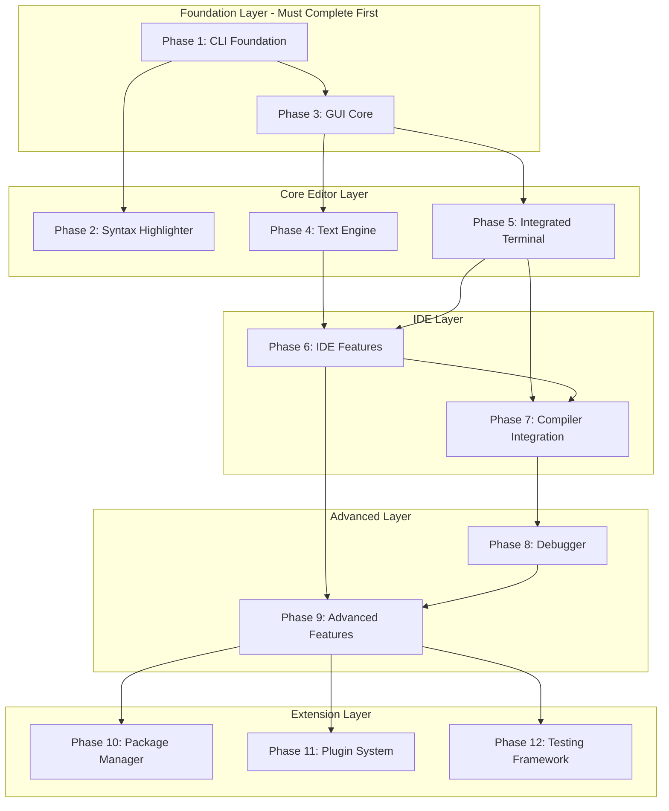
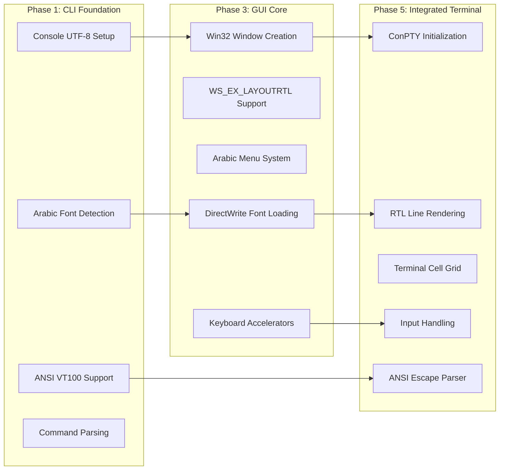

# Qalam IDE - Comprehensive Roadmap Analysis

## Executive Summary

**Qalam (قلم)** is an Arabic-first Integrated Development Environment designed specifically for the **Baa (باء)** programming language. The project aims to solve fundamental problems that existing editors have with Arabic text rendering, RTL layout, and Arabic console support.

### Core Mission
Build a professional IDE from scratch in C that provides:
- Complete RTL (Right-to-Left) UI support
- Proper Arabic text shaping and rendering
- An integrated terminal that solves CMD/PowerShell Arabic display issues
- Native performance without Electron or web technologies

### Final Deliverables
| Executable | Purpose |
|------------|---------|
| `qalam.exe` | Main graphical IDE |
| `qalam-cli.exe` | Command-line interface |
| `qalam-term.exe` | Standalone Arabic terminal (optional) |
| `baa-pkg.exe` | Package manager |

### Target Platform
- **OS**: Windows 10 version 1903+ (required for ConPTY API)
- **Minimum RAM**: 256 MB (recommended 512 MB+)
- **Display**: 1024×768 minimum (1920×1080 recommended)

---

## Phase Dependency Analysis

### All 12 Phases Overview

| Phase | Name | Objective | Key Deliverables | Criticality |
|-------|------|-----------|------------------|-------------|
| 1 | CLI Foundation | Arabic-aware command-line interface | `qalam-cli.exe`, UTF-8 console setup, Arabic font detection | 🔴 Critical |
| 2 | Syntax Highlighter | Code colorization for Baa | `qalam-highlight.exe`, ANSI/HTML output | 🟡 High |
| 3 | GUI Core | Win32 window with RTL layout | Basic window, menus, toolbar, statusbar | 🔴 Critical |
| 4 | Text Engine | Full-featured text editor core | Gap Buffer, Undo/Redo, Cursor, BiDi support | 🔴 Critical |
| 5 | Integrated Terminal | Arabic terminal solving CMD issues | ConPTY integration, ANSI parser, RTL rendering | 🔴 Critical |
| 6 | IDE Features | Professional IDE capabilities | Syntax highlighting, completion, diagnostics | 🟡 High |
| 7 | Compiler Integration | Build-run-debug workflow | Process management, error parsing, run configurations | 🔴 Critical |
| 8 | Debugger | Interactive debugging | Breakpoints, stepping, variable inspection | 🟡 High |
| 9 | Advanced Features | Power user features | Settings, sessions, search/replace, code folding | 🟡 High |
| 10 | Package Manager | Dependency management | `baa-pkg.exe`, registry, version resolution | 🟢 Medium |
| 11 | Plugin System | Extensibility | Plugin API, DLL loading, command registration | 🟢 Medium |
| 12 | Testing Framework | Test support | Test discovery, execution, coverage | 🟢 Medium |

### Critical Path Identification



### Phase 1 → Phase 3 → Phase 5 Dependency Chain

This is the **most critical path** for the core IDE functionality:



#### Phase 1 Components That Unblock Phase 3:
1. **Console UTF-8 Setup** ([`qalam_console_init()`](QALAM_ROADMAP_1.md:239)) - Establishes UTF-8 handling patterns used throughout
2. **Arabic Font Detection** - Font enumeration logic reused for GUI font selection
3. **ANSI Color Support** - VT100 mode detection informs terminal capabilities

#### Phase 3 Components That Unblock Phase 5:
1. **Win32 Window Creation** - Terminal needs a parent window for embedding
2. **DirectWrite Integration** - Terminal reuses font rendering infrastructure
3. **RTL Layout** (`WS_EX_LAYOUTRTL`) - Terminal inherits RTL coordinate system
4. **Keyboard Handling** - Terminal input requires accelerator infrastructure

### Parallel Development Opportunities

Based on the dependency analysis, these phases can be developed in parallel:

| Parallel Track A | Parallel Track B | Condition |
|------------------|------------------|-----------|
| Phase 2 (Syntax Highlighter) | Phase 3 (GUI Core) | After Phase 1 complete |
| Phase 4 (Text Engine) | Phase 5 (Terminal) | After Phase 3 complete |
| Phase 8 (Debugger) | Phase 9 (Advanced Features) | After Phase 7 complete |
| Phase 10, 11, 12 | All can be parallel | After Phase 9 complete |

---

## Sprint 1 Priorities - Core Infrastructure

### Priority 1: Win32 Window Creation with RTL Layout Support

**Source**: [QALAM_ROADMAP_1.md](QALAM_ROADMAP_1.md:828-1022) - Phase 3

**Key Components:**
| Component | File | Description |
|-----------|------|-------------|
| Window Class Registration | [`window.c`](QALAM_ROADMAP_1.md:955-968) | `WNDCLASSEXW` with proper styles |
| RTL Extended Style | [`window.c`](QALAM_ROADMAP_1.md:977-979) | `WS_EX_LAYOUTRTL \| WS_EX_RTLREADING` |
| Arabic Menu System | [`menu.c`](QALAM_ROADMAP_1.md:1028-1104) | RTL-ordered menu items |
| Keyboard Accelerators | [`accelerators.c`](QALAM_ROADMAP_1.md:1164-1199) | Arabic-aware shortcuts |

**RTL Layout Configuration:**
```c
// Critical RTL flags for window creation
DWORD exStyle = WS_EX_APPWINDOW;
if (win->rtl_layout) {
    exStyle |= WS_EX_LAYOUTRTL | WS_EX_RTLREADING;
}
```

**Required Structures:**
- [`QalamWindow`](QALAM_ROADMAP_1.md:902-927) - Main window state
- [`PanelState`](QALAM_ROADMAP_1.md:890-899) - Panel layout management

### Priority 2: Arabic-Aware Console Initialization with UTF-8

**Source**: [QALAM_ROADMAP_1.md](QALAM_ROADMAP_1.md:169-343) - Phase 1

**Key Components:**
| Component | Function | Purpose |
|-----------|----------|---------|
| Console Handle Acquisition | [`qalam_console_init()`](QALAM_ROADMAP_1.md:239-293) | Get stdout/stdin handles |
| UTF-8 Code Page | `SetConsoleOutputCP(CP_UTF8)` | Enable Unicode output |
| VT100 Mode | `ENABLE_VIRTUAL_TERMINAL_PROCESSING` | ANSI color support |
| Arabic Font Setup | `SetCurrentConsoleFontEx()` | Set Cascadia Code/Mono |

**Console Initialization Sequence:**
```c
// 1. Get handles
console->hStdOut = GetStdHandle(STD_OUTPUT_HANDLE);

// 2. Save original settings (for cleanup)
GetConsoleMode(console->hStdOut, &console->original_out_mode);
console->original_cp_out = GetConsoleOutputCP();

// 3. Set UTF-8
SetConsoleOutputCP(CP_UTF8);
SetConsoleCP(CP_UTF8);

// 4. Enable VT100
DWORD out_mode = console->original_out_mode;
out_mode |= ENABLE_VIRTUAL_TERMINAL_PROCESSING;
SetConsoleMode(console->hStdOut, out_mode);

// 5. Set Arabic-capable font
// Priority: Cascadia Code > Cascadia Mono > Consolas > Courier New
```

### Priority 3: Basic Gap Buffer Text Storage Implementation

**Source**: [QALAM_ROADMAP_2.md](QALAM_ROADMAP_2.md:14-217) - Phase 4

**Key Components:**
| Component | Description |
|-----------|-------------|
| [`QalamBuffer`](QALAM_ROADMAP_2.md:31-55) | Main buffer structure with gap |
| [`buffer_create()`](QALAM_ROADMAP_2.md:92-117) | Allocate initial gap |
| [`buffer_insert()`](QALAM_ROADMAP_2.md:183-196) | Insert text at position |
| [`buffer_delete()`](QALAM_ROADMAP_2.md:198-206) | Delete text range |
| [`move_gap()`](QALAM_ROADMAP_2.md:137-159) | Move gap to cursor position |

**Gap Buffer Concept:**
```
[text before gap][....GAP....][text after gap]
     ^gap_start       ^gap_end
```

**Critical Constants:**
```c
#define INITIAL_GAP_SIZE    4096
#define GAP_GROW_SIZE       2048
#define MAX_LINE_LENGTH     10000
```

---

## Technical Requirements Summary

### Windows API Requirements

| API | Version | Purpose | Documentation |
|-----|---------|---------|---------------|
| Win32 | Windows 10+ | Window management, menus, dialogs | Core window system |
| DirectWrite | Windows 7+ | Arabic text shaping and rendering | Font rendering with proper ligatures |
| ConPTY | Windows 10 1903+ | Pseudo-console for terminal | [Creating a Pseudoconsole Session](https://docs.microsoft.com/en-us/windows/console/creating-a-pseudoconsole-session) |
| Uniscribe | Windows 2000+ | BiDi text analysis | Unicode bidirectional algorithm |

### DirectWrite vs GDI+ Decision

**The roadmap specifies DirectWrite** for Arabic text rendering:

| Feature | DirectWrite | GDI+ |
|---------|-------------|------|
| Arabic Shaping | ✅ Full OpenType support | ⚠️ Limited |
| Ligatures | ✅ Automatic | ❌ Manual |
| Performance | ✅ Hardware accelerated | ⚠️ Software |
| Subpixel rendering | ✅ ClearType | ⚠️ Basic |
| Complex scripts | ✅ Full UAX #9 | ⚠️ Partial |

**Recommended**: Use DirectWrite for all text rendering in the editor and terminal.

### ConPTY Requirements

**Minimum Windows Version**: Windows 10 version 1903 (build 18362)

**Key APIs:**
- [`CreatePseudoConsole()`](QALAM_ROADMAP_2.md:789) - Create pseudo-console
- [`ResizePseudoConsole()`] - Handle terminal resize
- [`ClosePseudoConsole()`] - Cleanup

**Required Process Attributes:**
```c
STARTUPINFOEXW si = {0};
si.StartupInfo.cb = sizeof(STARTUPINFOEXW);
// Must use PROC_THREAD_ATTRIBUTE_PSEUDOCONSOLE
UpdateProcThreadAttribute(si.lpAttributeList, 0,
    PROC_THREAD_ATTRIBUTE_PSEUDOCONSOLE,
    hpc, sizeof(HPCON), NULL, NULL);
```

---

## Architectural Decisions Extracted

### 1. Bidirectional (BiDi) Text Algorithm

**Source**: [QALAM_ROADMAP_2.md](QALAM_ROADMAP_2.md:315-486) - [`bidi.h`](QALAM_ROADMAP_2.md:316-368), [`bidi.c`](QALAM_ROADMAP_2.md:371-486)

**Implementation Approach:**
- Use Windows **Uniscribe** API ([`ScriptItemize()`](QALAM_ROADMAP_2.md:429), `ScriptLayout()`)
- Implement UAX #9 Unicode Bidirectional Algorithm
- Maintain logical-to-visual and visual-to-logical position mappings

**Key Structures:**
```c
typedef struct {
    BidiRun* runs;           // Text segments with uniform direction
    size_t run_count;
    size_t* logical_to_visual;
    size_t* visual_to_logical;
    TextDirection base_direction;
} BidiLayout;
```

**Arabic Character Detection:**
```c
bool bidi_is_rtl_char(wchar_t ch) {
    // Arabic ranges
    if (ch >= 0x0600 && ch <= 0x06FF) return true;  // Arabic
    if (ch >= 0x0750 && ch <= 0x077F) return true;  // Arabic Supplement
    if (ch >= 0xFB50 && ch <= 0xFDFF) return true;  // Arabic Presentation Forms-A
    if (ch >= 0xFE70 && ch <= 0xFEFF) return true;  // Arabic Presentation Forms-B
    if (ch >= 0x08A0 && ch <= 0x08FF) return true;  // Arabic Extended-A
    return false;
}
```

### 2. Gap Buffer Text Storage

**Source**: [QALAM_ROADMAP_2.md](QALAM_ROADMAP_2.md:16-217)

**Why Gap Buffer:**
- O(1) insertion/deletion at cursor position
- Efficient for local editing patterns (most edits are near cursor)
- Lower memory overhead than rope data structure
- Simpler implementation than piece table

**Structure:**
```c
typedef struct {
    wchar_t* data;        // The buffer data
    size_t size;          // Total allocated size
    size_t gap_start;     // Start of gap
    size_t gap_end;       // End of gap (exclusive)
    
    size_t* line_starts;  // Line start positions for quick lookup
    size_t line_count;
} QalamBuffer;
```

### 3. RTL Layout Support Mechanisms

**Window-Level RTL:**
```c
// Use WS_EX_LAYOUTRTL for automatic coordinate mirroring
exStyle |= WS_EX_LAYOUTRTL | WS_EX_RTLREADING;
```

**Editor-Level RTL Settings:**
```c
typedef struct {
    bool editor_rtl_default;       // Default to RTL
    bool line_numbers_on_right;    // Numbers on right side
    bool gutter_on_right;          // Gutter on right side
    bool cursor_visual_movement;   // Move cursor visually (not logically)
} RTLSettings;
```

**Terminal RTL:**
- Auto-detect line direction based on first strong character
- Render RTL lines from right edge: [`terminal_paint_line_rtl()`](QALAM_ROADMAP_2.md:1067-1093)

---

## Identified Risks and Open Questions

### Technical Risks

| Risk | Severity | Mitigation |
|------|----------|------------|
| ConPTY only available on Windows 10 1903+ | 🔴 High | Document minimum requirements, consider fallback for older Windows |
| DirectWrite complexity for Arabic shaping | 🟡 Medium | Start with simple text rendering, incrementally add complex script support |
| Bidi algorithm edge cases with mixed LTR/RTL | 🟡 Medium | Extensive testing with real Arabic/English mixed content |
| Gap Buffer performance with very large files | 🟢 Low | Consider piece table for files > 10MB |

### Architectural Questions Not Fully Specified

1. **Font Fallback Strategy**: How to handle characters not in primary font?
   - Roadmap mentions font priority list but not fallback chains

2. **Undo Grouping Logic**: When should consecutive edits be grouped?
   - [`EditAction`](QALAM_ROADMAP_2.md:225-240) has `is_grouped` and `timestamp` but grouping algorithm not specified

3. **Plugin Sandboxing**: Are plugins isolated or can they crash the main process?
   - DLL-based plugins have full process access

4. **Multi-file Undo**: Can undo span across files in a project?
   - Not addressed in roadmap

5. **Terminal Selection**: How does selection work with RTL lines?
   - Auto-detect RTL mentioned but selection behavior unclear

### Missing Information

1. **Build System**: CMakeLists.txt structure not detailed
2. **Error Handling Strategy**: No global error handling pattern defined
3. **Memory Management**: No arena allocator or custom allocator mentioned
4. **Threading Model**: Terminal read thread mentioned but no thread safety patterns
5. **Testing Strategy**: Phase 12 describes framework but not unit test approach for core code

---

## Summary

### Critical Path Summary

```
Phase 1 (CLI) ──┬──> Phase 2 (Highlighter)
                │
                └──> Phase 3 (GUI) ──┬──> Phase 4 (Text Engine) ──┐
                                     │                            │
                                     └──> Phase 5 (Terminal) ─────┴──> Phase 6-12
```

### Sprint 1 Implementation Order

1. **Win32 Window with RTL Layout** - Foundation for all GUI
2. **UTF-8 Console Initialization** - Foundation for CLI tools  
3. **Gap Buffer Implementation** - Core text storage
4. **Basic DirectWrite Text Rendering** - Display Arabic text correctly

### Key Technical Decisions Already Made

| Decision | Choice | Rationale |
|----------|--------|-----------|
| Language | C | Native performance, minimal dependencies |
| Text Storage | Gap Buffer | Efficient local edits |
| Font Rendering | DirectWrite | Best Arabic shaping support |
| Terminal | ConPTY | Modern pseudo-console API |
| BiDi | Uniscribe | Windows-native UAX #9 implementation |
| UI Framework | Raw Win32 | Full RTL control, no framework overhead |

---

*Analysis generated from QALAM_ROADMAP_1.md through QALAM_ROADMAP_4.md*