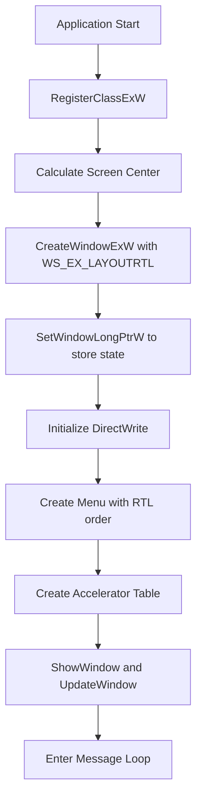
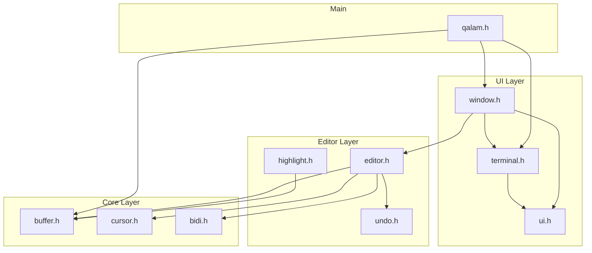

# Qalam IDE - Sprint 1 Implementation Plan

## Executive Summary

This document provides a detailed implementation plan for Sprint 1 of the Qalam IDE project, covering the three foundational components required before any further development can proceed.

### Sprint 1 Scope

| Component | Priority | Description |
|-----------|----------|-------------|
| Win32 Window with RTL Layout | 🔴 Critical | Foundation for all GUI components |
| Arabic-Aware Console | 🔴 Critical | Foundation for CLI tools and terminal |
| Gap Buffer Text Storage | 🔴 Critical | Core text storage for editor |

### Success Criteria

Sprint 1 is complete when:
1. A Win32 window displays with full RTL layout support and Arabic text rendering
2. Console applications can display Arabic text correctly with ANSI color support
3. Gap buffer can insert, delete, and navigate text with O(1) cursor operations
4. All acceptance tests pass for each component

---

## Component 1: Win32 Window with RTL Layout

### 1.1 Windows API Calls Required

#### Window Class Registration

```c
// Required API: RegisterClassExW
WNDCLASSEXW wc = {0};
wc.cbSize        = sizeof(WNDCLASSEXW);
wc.style         = CS_HREDRAW | CS_VREDRAW | CS_DBLCLKS;
wc.lpfnWndProc   = QalamWindowProc;
wc.hInstance     = hInstance;
wc.hCursor       = LoadCursor(NULL, IDC_ARROW);
wc.hbrBackground = NULL;  // Custom painting
wc.lpszClassName = L"QalamMainWindow";
wc.hIcon         = LoadIconW(hInstance, MAKEINTRESOURCEW(IDI_QALAM));
wc.hIconSm       = LoadIconW(hInstance, MAKEINTRESOURCEW(IDI_QALAM_SMALL));

ATOM atom = RegisterClassExW(&wc);
```

#### Window Creation with RTL Extended Styles

```c
// Required API: CreateWindowExW
// RTL Extended Styles - CRITICAL for Arabic UI
DWORD dwExStyle = WS_EX_APPWINDOW | WS_EX_OVERLAPPEDWINDOW;

// Enable RTL layout mirroring
dwExStyle |= WS_EX_LAYOUTRTL;     // Mirror all coordinates
dwExStyle |= WS_EX_RTLREADING;    // Right-to-left reading order

DWORD dwStyle = WS_OVERLAPPEDWINDOW | WS_CLIPCHILDREN | WS_CLIPSIBLINGS;

HWND hwnd = CreateWindowExW(
    dwExStyle,
    L"QalamMainWindow",
    L"قلم - Qalam IDE",
    dwStyle,
    CW_USEDEFAULT, CW_USEDEFAULT,  // Position
    1280, 720,                      // Size
    NULL,                           // Parent
    NULL,                           // Menu (set separately)
    hInstance,
    pWindowState                    // User data
);
```

### 1.2 RTL Layout Initialization Sequence



#### Step-by-Step Initialization

| Step | API Call | Purpose |
|------|----------|---------|
| 1 | `SetProcessDPIAware()` | Enable DPI awareness for high-res displays |
| 2 | `RegisterClassExW()` | Register window class with Unicode support |
| 3 | `GetSystemMetrics(SM_CXSCREEN/SM_CYSCREEN)` | Get screen dimensions for centering |
| 4 | `CreateWindowExW()` | Create main window with RTL styles |
| 5 | `SetWindowLongPtrW(GWLP_USERDATA)` | Store window state pointer |
| 6 | `D2D1CreateFactory()` | Initialize Direct2D for rendering |
| 7 | `DWriteCreateFactory()` | Initialize DirectWrite for text |
| 8 | `CreateMenu()` / `AppendMenuW()` | Build Arabic menu structure |
| 9 | `SetMenu()` | Attach menu to window |
| 10 | `CreateAcceleratorTableW()` | Register keyboard shortcuts |
| 11 | `ShowWindow(SW_SHOW)` | Display window |
| 12 | `UpdateWindow()` | Force initial paint |

### 1.3 DirectWrite Factory and Render Target Setup

#### Factory Initialization

```c
// DirectWrite Factory
IDWriteFactory* pDWriteFactory = NULL;
HRESULT hr = DWriteCreateFactory(
    DWRITE_FACTORY_TYPE_SHARED,
    &IID_IDWriteFactory,
    (IUnknown**)&pDWriteFactory
);

// Direct2D Factory
ID2D1Factory* pD2DFactory = NULL;
hr = D2D1CreateFactory(
    D2D1_FACTORY_TYPE_SINGLE_THREADED,
    &IID_ID2D1Factory,
    NULL,
    (void**)&pD2DFactory
);
```

#### Render Target Creation

```c
// Get client area dimensions
RECT rc;
GetClientRect(hwnd, &rc);

// Create render target properties
D2D1_RENDER_TARGET_PROPERTIES rtProps = {
    .type = D2D1_RENDER_TARGET_TYPE_DEFAULT,
    .pixelFormat = {
        .format = DXGI_FORMAT_B8G8R8A8_UNORM,
        .alphaMode = D2D1_ALPHA_MODE_PREMULTIPLIED
    },
    .dpiX = 0.0f,  // Use default DPI
    .dpiY = 0.0f,
    .usage = D2D1_RENDER_TARGET_USAGE_NONE,
    .minLevel = D2D1_FEATURE_LEVEL_DEFAULT
};

D2D1_HWND_RENDER_TARGET_PROPERTIES hwndRtProps = {
    .hwnd = hwnd,
    .pixelSize = {rc.right - rc.left, rc.bottom - rc.top},
    .presentOptions = D2D1_PRESENT_OPTIONS_NONE
};

ID2D1HwndRenderTarget* pRenderTarget = NULL;
hr = pD2DFactory->lpVtbl->CreateHwndRenderTarget(
    pD2DFactory,
    &rtProps,
    &hwndRtProps,
    &pRenderTarget
);
```

#### Text Format for Arabic

```c
// Create text format with Arabic-capable font
IDWriteTextFormat* pTextFormat = NULL;
hr = pDWriteFactory->lpVtbl->CreateTextFormat(
    pDWriteFactory,
    L"Cascadia Code",           // Font family
    NULL,                        // Font collection (system default)
    DWRITE_FONT_WEIGHT_NORMAL,
    DWRITE_FONT_STYLE_NORMAL,
    DWRITE_FONT_STRETCH_NORMAL,
    16.0f,                       // Font size in DIPs
    L"ar",                       // Locale - Arabic
    &pTextFormat
);

// Set reading direction for RTL
pTextFormat->lpVtbl->SetReadingDirection(
    pTextFormat,
    DWRITE_READING_DIRECTION_RIGHT_TO_LEFT
);

// Set paragraph alignment
pTextFormat->lpVtbl->SetParagraphAlignment(
    pTextFormat,
    DWRITE_PARAGRAPH_ALIGNMENT_NEAR
);
```

### 1.4 Window Message Pump Structure

```c
int WINAPI wWinMain(HINSTANCE hInstance, HINSTANCE hPrevInstance,
                    LPWSTR lpCmdLine, int nCmdShow) {
    // Initialize COM for DirectWrite
    HRESULT hr = CoInitializeEx(NULL, COINIT_APARTMENTTHREADED);
    if (FAILED(hr)) return 1;
    
    // Initialize window
    QalamWindow win = {0};
    win.rtl_layout = true;  // Default to RTL
    
    if (!qalam_window_create(&win, hInstance)) {
        CoUninitialize();
        return 1;
    }
    
    // Message loop with accelerator support
    MSG msg;
    while (GetMessageW(&msg, NULL, 0, 0) > 0) {
        // Check for keyboard accelerators first
        if (!TranslateAcceleratorW(win.hwnd, win.haccel, &msg)) {
            TranslateMessage(&msg);
            DispatchMessageW(&msg);
        }
    }
    
    // Cleanup
    qalam_window_destroy(&win);
    CoUninitialize();
    
    return (int)msg.wParam;
}

LRESULT CALLBACK QalamWindowProc(HWND hwnd, UINT msg, 
                                  WPARAM wParam, LPARAM lParam) {
    QalamWindow* win = (QalamWindow*)GetWindowLongPtrW(hwnd, GWLP_USERDATA);
    
    switch (msg) {
    case WM_CREATE:
        // Store window state pointer
        CREATESTRUCTW* pcs = (CREATESTRUCTW*)lParam;
        SetWindowLongPtrW(hwnd, GWLP_USERDATA, (LONG_PTR)pcs->lpCreateParams);
        return 0;
        
    case WM_SIZE:
        if (win && win->pRenderTarget) {
            D2D1_SIZE_U size = {LOWORD(lParam), HIWORD(lParam)};
            win->pRenderTarget->lpVtbl->Resize(win->pRenderTarget, &size);
        }
        return 0;
        
    case WM_PAINT:
        qalam_window_paint(win);
        return 0;
        
    case WM_COMMAND:
        qalam_handle_command(win, LOWORD(wParam));
        return 0;
        
    case WM_KEYDOWN:
        qalam_handle_keydown(win, wParam, lParam);
        return 0;
        
    case WM_CHAR:
        qalam_handle_char(win, (wchar_t)wParam);
        return 0;
        
    case WM_DESTROY:
        PostQuitMessage(0);
        return 0;
    }
    
    return DefWindowProcW(hwnd, msg, wParam, lParam);
}
```

### 1.5 Initial Window Dimensions and Positioning

```c
// Constants
#define QALAM_DEFAULT_WIDTH   1280
#define QALAM_DEFAULT_HEIGHT  720
#define QALAM_MIN_WIDTH       800
#define QALAM_MIN_HEIGHT      600

// Calculate centered position
int screen_width  = GetSystemMetrics(SM_CXSCREEN);
int screen_height = GetSystemMetrics(SM_CYSCREEN);
int window_x = (screen_width - QALAM_DEFAULT_WIDTH) / 2;
int window_y = (screen_height - QALAM_DEFAULT_HEIGHT) / 2;

// Handle minimum size in WM_GETMINMAXINFO
case WM_GETMINMAXINFO: {
    MINMAXINFO* mmi = (MINMAXINFO*)lParam;
    mmi->ptMinTrackSize.x = QALAM_MIN_WIDTH;
    mmi->ptMinTrackSize.y = QALAM_MIN_HEIGHT;
    return 0;
}
```

---

## Component 2: Arabic-Aware Console

### 2.1 UTF-8 Initialization Sequence

```c
typedef struct {
    HANDLE hStdOut;
    HANDLE hStdIn;
    HANDLE hStdErr;
    
    DWORD dwOriginalOutMode;
    DWORD dwOriginalInMode;
    UINT uOriginalOutputCP;
    UINT uOriginalInputCP;
    
    bool bVT100Supported;
    bool bArabicFontSet;
    wchar_t wszFontName[LF_FACESIZE];
} QalamConsole;

bool qalam_console_init(QalamConsole* pConsole) {
    if (!pConsole) return false;
    
    // Step 1: Get standard handles
    pConsole->hStdOut = GetStdHandle(STD_OUTPUT_HANDLE);
    pConsole->hStdIn  = GetStdHandle(STD_INPUT_HANDLE);
    pConsole->hStdErr = GetStdHandle(STD_ERROR_HANDLE);
    
    if (pConsole->hStdOut == INVALID_HANDLE_VALUE) {
        return false;
    }
    
    // Step 2: Save original settings for cleanup
    GetConsoleMode(pConsole->hStdOut, &pConsole->dwOriginalOutMode);
    GetConsoleMode(pConsole->hStdIn, &pConsole->dwOriginalInMode);
    pConsole->uOriginalOutputCP = GetConsoleOutputCP();
    pConsole->uOriginalInputCP  = GetConsoleCP();
    
    // Step 3: Set UTF-8 code pages
    if (!SetConsoleOutputCP(CP_UTF8)) {
        // Fallback: try UTF-16
        // Log warning but continue
    }
    if (!SetConsoleCP(CP_UTF8)) {
        // Input UTF-8 failed - may affect input handling
    }
    
    // Step 4: Enable VT100 processing
    DWORD dwOutMode = pConsole->dwOriginalOutMode;
    dwOutMode |= ENABLE_VIRTUAL_TERMINAL_PROCESSING;
    dwOutMode |= ENABLE_PROCESSED_OUTPUT;
    
    pConsole->bVT100Supported = SetConsoleMode(pConsole->hStdOut, dwOutMode);
    
    // Step 5: Configure input mode
    DWORD dwInMode = pConsole->dwOriginalInMode;
    dwInMode |= ENABLE_VIRTUAL_TERMINAL_INPUT;
    dwInMode &= ~ENABLE_LINE_INPUT;      // Optional: for raw input
    dwInMode &= ~ENABLE_ECHO_INPUT;      // Optional: for raw input
    SetConsoleMode(pConsole->hStdIn, dwInMode);
    
    // Step 6: Set Arabic-capable font
    pConsole->bArabicFontSet = qalam_console_set_font(pConsole);
    
    return true;
}
```

### 2.2 VT100 Mode Enabling

```c
// Required console modes for VT100/ANSI support
#define QALAM_CONSOLE_OUTPUT_MODE ( \
    ENABLE_PROCESSED_OUTPUT | \
    ENABLE_VIRTUAL_TERMINAL_PROCESSING | \
    DISABLE_NEWLINE_AUTO_RETURN \
)

#define QALAM_CONSOLE_INPUT_MODE ( \
    ENABLE_VIRTUAL_TERMINAL_INPUT | \
    ENABLE_WINDOW_INPUT | \
    ENABLE_MOUSE_INPUT \
)

bool qalam_console_enable_vt100(HANDLE hConsole) {
    DWORD dwMode = 0;
    
    if (!GetConsoleMode(hConsole, &dwMode)) {
        return false;
    }
    
    // Add VT100 processing flag
    dwMode |= ENABLE_VIRTUAL_TERMINAL_PROCESSING;
    
    if (!SetConsoleMode(hConsole, dwMode)) {
        // VT100 not supported - Windows version too old
        return false;
    }
    
    return true;
}

// Check if VT100 is available
bool qalam_console_check_vt100_support(void) {
    HANDLE hOut = GetStdHandle(STD_OUTPUT_HANDLE);
    DWORD dwMode = 0;
    
    if (!GetConsoleMode(hOut, &dwMode)) {
        return false;
    }
    
    DWORD dwNewMode = dwMode | ENABLE_VIRTUAL_TERMINAL_PROCESSING;
    
    if (!SetConsoleMode(hOut, dwNewMode)) {
        return false;
    }
    
    // Restore original mode
    SetConsoleMode(hOut, dwMode);
    return true;
}
```

### 2.3 ANSI Escape Sequence Handling Strategy

```c
// ANSI escape code definitions
#define ANSI_ESC          L"\033"
#define ANSI_CSI          L"\033["
#define ANSI_RESET        L"\033[0m"
#define ANSI_BOLD         L"\033[1m"
#define ANSI_DIM          L"\033[2m"
#define ANSI_UNDERLINE    L"\033[4m"
#define ANSI_BLINK        L"\033[5m"
#define ANSI_REVERSE      L"\033[7m"

// Foreground colors
#define ANSI_FG_BLACK     L"\033[30m"
#define ANSI_FG_RED       L"\033[31m"
#define ANSI_FG_GREEN     L"\033[32m"
#define ANSI_FG_YELLOW    L"\033[33m"
#define ANSI_FG_BLUE      L"\033[34m"
#define ANSI_FG_MAGENTA   L"\033[35m"
#define ANSI_FG_CYAN      L"\033[36m"
#define ANSI_FG_WHITE     L"\033[37m"

// Background colors
#define ANSI_BG_BLACK     L"\033[40m"
#define ANSI_BG_RED       L"\033[41m"
#define ANSI_BG_GREEN     L"\033[42m"
#define ANSI_BG_YELLOW    L"\033[43m"
#define ANSI_BG_BLUE      L"\033[44m"
#define ANSI_BG_MAGENTA   L"\033[45m"
#define ANSI_BG_CYAN      L"\033[46m"
#define ANSI_BG_WHITE     L"\033[47m"

// 256-color format: ESC[38;5;{n}m (foreground) ESC[48;5;{n}m (background)
// True color format: ESC[38;2;{r};{g};{b}m

// Printing with color
void qalam_print_colored(const wchar_t* text, int color_code) {
    HANDLE hOut = GetStdHandle(STD_OUTPUT_HANDLE);
    
    wchar_t buffer[4096];
    swprintf(buffer, 4096, L"\033[%dm%ls\033[0m", color_code, text);
    
    DWORD written;
    WriteConsoleW(hOut, buffer, (DWORD)wcslen(buffer), &written, NULL);
}

// Cursor movement
void qalam_cursor_move(int row, int col) {
    wprintf(L"\033[%d;%dH", row, col);
}

void qalam_cursor_up(int n)    { wprintf(L"\033[%dA", n); }
void qalam_cursor_down(int n)  { wprintf(L"\033[%dB", n); }
void qalam_cursor_right(int n) { wprintf(L"\033[%dC", n); }
void qalam_cursor_left(int n)  { wprintf(L"\033[%dD", n); }

// Screen operations
void qalam_clear_screen(void)      { wprintf(L"\033[2J\033[H"); }
void qalam_clear_line(void)        { wprintf(L"\033[2K"); }
void qalam_clear_to_end_line(void) { wprintf(L"\033[K"); }
```

### 2.4 Console Input Handling for Arabic Characters

```c
// Arabic input handling
typedef struct {
    wchar_t buffer[1024];
    size_t  length;
    size_t  cursor;
    bool    insert_mode;
} InputLine;

bool qalam_read_input(InputLine* line) {
    HANDLE hIn = GetStdHandle(STD_INPUT_HANDLE);
    INPUT_RECORD record;
    DWORD read;
    
    while (ReadConsoleInputW(hIn, &record, 1, &read)) {
        if (record.EventType != KEY_EVENT) continue;
        if (!record.Event.KeyEvent.bKeyDown) continue;
        
        KEY_EVENT_RECORD* key = &record.Event.KeyEvent;
        wchar_t ch = key->uChar.UnicodeChar;
        
        // Handle special keys
        switch (key->wVirtualKeyCode) {
        case VK_RETURN:
            return true;  // Line complete
            
        case VK_BACK:
            if (line->cursor > 0) {
                memmove(&line->buffer[line->cursor - 1],
                        &line->buffer[line->cursor],
                        (line->length - line->cursor) * sizeof(wchar_t));
                line->cursor--;
                line->length--;
            }
            break;
            
        case VK_DELETE:
            if (line->cursor < line->length) {
                memmove(&line->buffer[line->cursor],
                        &line->buffer[line->cursor + 1],
                        (line->length - line->cursor - 1) * sizeof(wchar_t));
                line->length--;
            }
            break;
            
        case VK_LEFT:
            if (line->cursor > 0) line->cursor--;
            break;
            
        case VK_RIGHT:
            if (line->cursor < line->length) line->cursor++;
            break;
            
        case VK_HOME:
            line->cursor = 0;
            break;
            
        case VK_END:
            line->cursor = line->length;
            break;
            
        default:
            // Regular character - including Arabic
            if (ch >= 32 && line->length < 1023) {
                if (line->insert_mode || line->cursor == line->length) {
                    // Insert mode: shift characters right
                    memmove(&line->buffer[line->cursor + 1],
                            &line->buffer[line->cursor],
                            (line->length - line->cursor) * sizeof(wchar_t));
                }
                line->buffer[line->cursor] = ch;
                line->cursor++;
                if (line->insert_mode || line->cursor > line->length) {
                    line->length++;
                }
            }
            break;
        }
    }
    
    return false;
}
```

### 2.5 Error Handling for Unsupported Console Configurations

```c
typedef enum {
    CONSOLE_OK = 0,
    CONSOLE_ERR_NO_HANDLE,
    CONSOLE_ERR_UTF8_OUTPUT,
    CONSOLE_ERR_UTF8_INPUT,
    CONSOLE_ERR_VT100,
    CONSOLE_ERR_FONT,
    CONSOLE_ERR_REDIRECTED,
} ConsoleError;

typedef struct {
    ConsoleError code;
    const wchar_t* message_ar;
    const wchar_t* message_en;
} ConsoleErrorInfo;

static const ConsoleErrorInfo CONSOLE_ERRORS[] = {
    {CONSOLE_OK, 
     L"لا يوجد خطأ", 
     L"No error"},
    {CONSOLE_ERR_NO_HANDLE, 
     L"فشل في الحصول على مقبض الطرفية", 
     L"Failed to get console handle"},
    {CONSOLE_ERR_UTF8_OUTPUT, 
     L"فشل في تعيين UTF-8 للإخراج", 
     L"Failed to set UTF-8 output code page"},
    {CONSOLE_ERR_UTF8_INPUT, 
     L"فشل في تعيين UTF-8 للإدخال", 
     L"Failed to set UTF-8 input code page"},
    {CONSOLE_ERR_VT100, 
     L"VT100 غير مدعوم - يلزم Windows 10 1903+", 
     L"VT100 not supported - requires Windows 10 1903+"},
    {CONSOLE_ERR_FONT, 
     L"فشل في تعيين خط عربي", 
     L"Failed to set Arabic font"},
    {CONSOLE_ERR_REDIRECTED, 
     L"الطرفية مُعاد توجيهها", 
     L"Console is redirected"},
};

ConsoleError qalam_console_validate(void) {
    HANDLE hOut = GetStdHandle(STD_OUTPUT_HANDLE);
    
    // Check if handle is valid
    if (hOut == INVALID_HANDLE_VALUE) {
        return CONSOLE_ERR_NO_HANDLE;
    }
    
    // Check if console is redirected
    DWORD mode;
    if (!GetConsoleMode(hOut, &mode)) {
        return CONSOLE_ERR_REDIRECTED;
    }
    
    // Check Windows version for VT100 support
    OSVERSIONINFOEXW osvi = {sizeof(osvi)};
    // Note: GetVersionExW is deprecated, use RtlGetVersion or VerifyVersionInfoW
    
    return CONSOLE_OK;
}

void qalam_console_print_error(ConsoleError err) {
    const ConsoleErrorInfo* info = &CONSOLE_ERRORS[err];
    fwprintf(stderr, L"[خطأ/Error] %ls / %ls\n", 
             info->message_ar, info->message_en);
}
```

### 2.6 Console Font Configuration

```c
bool qalam_console_set_font(QalamConsole* pConsole) {
    CONSOLE_FONT_INFOEX cfi = {0};
    cfi.cbSize = sizeof(CONSOLE_FONT_INFOEX);
    cfi.dwFontSize.Y = 16;
    cfi.FontFamily = FF_DONTCARE;
    cfi.FontWeight = FW_NORMAL;
    
    // Font priority list for Arabic support
    static const wchar_t* FONTS[] = {
        L"Cascadia Code",
        L"Cascadia Mono",
        L"Consolas",
        L"Lucida Console",
        L"Courier New",
        NULL
    };
    
    for (int i = 0; FONTS[i] != NULL; i++) {
        wcscpy_s(cfi.FaceName, LF_FACESIZE, FONTS[i]);
        
        if (SetCurrentConsoleFontEx(pConsole->hStdOut, FALSE, &cfi)) {
            wcscpy_s(pConsole->wszFontName, LF_FACESIZE, FONTS[i]);
            return true;
        }
    }
    
    return false;
}
```

---

## Component 3: Gap Buffer Text Storage

### 3.1 Data Structure Definition

```c
// === buffer.h ===

#ifndef QALAM_BUFFER_H
#define QALAM_BUFFER_H

#include <stddef.h>
#include <stdint.h>
#include <stdbool.h>
#include <wchar.h>

// Configuration constants
#define QALAM_INITIAL_GAP_SIZE    4096   // Initial gap size in wchar_t
#define QALAM_GAP_GROW_SIZE       2048   // Growth increment
#define QALAM_INITIAL_LINE_CAP    1024   // Initial line array capacity
#define QALAM_MAX_LINE_LENGTH     10000  // Maximum line length

// Line ending types
typedef enum {
    LINE_ENDING_LF = 0,    // Unix: \n
    LINE_ENDING_CRLF = 1,  // Windows: \r\n
    LINE_ENDING_CR = 2,    // Classic Mac: \r
} LineEnding;

// File encoding types
typedef enum {
    ENCODING_UTF8 = 65001,
    ENCODING_UTF16_LE = 1200,
    ENCODING_UTF16_BE = 1201,
    ENCODING_ASCII = 20127,
} FileEncoding;

// Gap Buffer structure
typedef struct {
    wchar_t*    data;           // Buffer storage
    size_t      capacity;       // Total allocated size (in wchar_t)
    size_t      gap_start;      // Start of gap (index)
    size_t      gap_end;        // End of gap (exclusive index)
    
    // Line tracking
    size_t*     line_starts;    // Array of line start positions
    size_t      line_count;     // Number of lines
    size_t      line_capacity;  // Allocated line array size
    
    // File metadata
    wchar_t     filepath[260];  // MAX_PATH
    bool        is_modified;    // Has unsaved changes
    bool        is_readonly;    // Read-only flag
    FileEncoding encoding;      // File encoding
    LineEnding  line_ending;    // Line ending style
    
    // Statistics
    size_t      char_count;     // Total character count (excluding gap)
    size_t      word_count;     // Approximate word count
    
} QalamBuffer;

#endif // QALAM_BUFFER_H
```

### 3.2 Core Operations: Insert, Delete, Move Cursor

```c
// === buffer.c ===

#include "buffer.h"
#include <stdlib.h>
#include <string.h>

// ============= INTERNAL HELPERS =============

// Get the size of the gap
static inline size_t gap_size(const QalamBuffer* buf) {
    return buf->gap_end - buf->gap_start;
}

// Get the logical length (text only, no gap)
size_t buffer_length(const QalamBuffer* buf) {
    return buf->capacity - gap_size(buf);
}

// Convert logical position to physical position
static inline size_t logical_to_physical(const QalamBuffer* buf, size_t pos) {
    if (pos < buf->gap_start) {
        return pos;
    } else {
        return pos + gap_size(buf);
    }
}

// ============= GAP MANAGEMENT =============

// Move the gap to a specific position
static void move_gap_to(QalamBuffer* buf, size_t pos) {
    if (pos == buf->gap_start) {
        return;  // Already there
    }
    
    size_t gs = gap_size(buf);
    
    if (pos < buf->gap_start) {
        // Move gap left: shift text right into gap
        size_t move_count = buf->gap_start - pos;
        memmove(
            buf->data + buf->gap_end - move_count,
            buf->data + pos,
            move_count * sizeof(wchar_t)
        );
        buf->gap_start = pos;
        buf->gap_end = pos + gs;
    } else {
        // Move gap right: shift text left into gap
        size_t move_count = pos - buf->gap_start;
        memmove(
            buf->data + buf->gap_start,
            buf->data + buf->gap_end,
            move_count * sizeof(wchar_t)
        );
        buf->gap_start = pos;
        buf->gap_end = pos + gs;
    }
}

// Ensure gap has enough space
static bool ensure_gap_size(QalamBuffer* buf, size_t needed) {
    if (gap_size(buf) >= needed) {
        return true;  // Already enough space
    }
    
    // Calculate new size
    size_t new_capacity = buf->capacity + needed + QALAM_GAP_GROW_SIZE;
    wchar_t* new_data = (wchar_t*)malloc(new_capacity * sizeof(wchar_t));
    
    if (!new_data) {
        return false;  // Allocation failed
    }
    
    // Copy text before gap
    if (buf->gap_start > 0) {
        memcpy(new_data, buf->data, buf->gap_start * sizeof(wchar_t));
    }
    
    // Copy text after gap
    size_t after_gap_len = buf->capacity - buf->gap_end;
    if (after_gap_len > 0) {
        memcpy(
            new_data + new_capacity - after_gap_len,
            buf->data + buf->gap_end,
            after_gap_len * sizeof(wchar_t)
        );
    }
    
    // Update buffer
    free(buf->data);
    buf->data = new_data;
    buf->gap_end = new_capacity - after_gap_len;
    buf->capacity = new_capacity;
    
    return true;
}

// ============= PUBLIC API =============

QalamBuffer* buffer_create(void) {
    QalamBuffer* buf = (QalamBuffer*)calloc(1, sizeof(QalamBuffer));
    if (!buf) return NULL;
    
    // Allocate main buffer
    buf->capacity = QALAM_INITIAL_GAP_SIZE;
    buf->data = (wchar_t*)malloc(buf->capacity * sizeof(wchar_t));
    if (!buf->data) {
        free(buf);
        return NULL;
    }
    
    // Gap spans entire buffer initially
    buf->gap_start = 0;
    buf->gap_end = buf->capacity;
    
    // Allocate line tracking
    buf->line_capacity = QALAM_INITIAL_LINE_CAP;
    buf->line_starts = (size_t*)malloc(buf->line_capacity * sizeof(size_t));
    if (!buf->line_starts) {
        free(buf->data);
        free(buf);
        return NULL;
    }
    
    // Start with one empty line
    buf->line_starts[0] = 0;
    buf->line_count = 1;
    
    // Defaults
    buf->encoding = ENCODING_UTF8;
    buf->line_ending = LINE_ENDING_LF;
    buf->is_modified = false;
    buf->is_readonly = false;
    
    return buf;
}

void buffer_destroy(QalamBuffer* buf) {
    if (!buf) return;
    free(buf->data);
    free(buf->line_starts);
    free(buf);
}

// Insert text at position
bool buffer_insert(QalamBuffer* buf, size_t pos, 
                   const wchar_t* text, size_t len) {
    if (!buf || !text || len == 0) return false;
    if (pos > buffer_length(buf)) return false;
    
    // Ensure we have space
    if (!ensure_gap_size(buf, len)) {
        return false;
    }
    
    // Move gap to insertion point
    move_gap_to(buf, pos);
    
    // Copy text into gap
    memcpy(buf->data + buf->gap_start, text, len * sizeof(wchar_t));
    buf->gap_start += len;
    
    buf->is_modified = true;
    
    // Recompute line starts (could be optimized for single-line inserts)
    buffer_recompute_lines(buf);
    
    return true;
}

// Insert single character
bool buffer_insert_char(QalamBuffer* buf, size_t pos, wchar_t ch) {
    return buffer_insert(buf, pos, &ch, 1);
}

// Delete text range
bool buffer_delete(QalamBuffer* buf, size_t pos, size_t len) {
    if (!buf || len == 0) return false;
    if (pos + len > buffer_length(buf)) return false;
    
    // Move gap to deletion start
    move_gap_to(buf, pos);
    
    // Expand gap to cover deleted text
    buf->gap_end += len;
    
    buf->is_modified = true;
    
    // Recompute line starts
    buffer_recompute_lines(buf);
    
    return true;
}

// Delete single character at position
bool buffer_delete_char(QalamBuffer* buf, size_t pos) {
    return buffer_delete(buf, pos, 1);
}

// Get character at position
wchar_t buffer_char_at(const QalamBuffer* buf, size_t pos) {
    if (!buf || pos >= buffer_length(buf)) {
        return L'\0';
    }
    
    size_t phys = logical_to_physical(buf, pos);
    return buf->data[phys];
}

// Copy text range to output buffer
bool buffer_get_text(const QalamBuffer* buf, size_t start, size_t len,
                     wchar_t* out, size_t out_size) {
    if (!buf || !out || out_size == 0) return false;
    if (start + len > buffer_length(buf)) return false;
    if (len >= out_size) len = out_size - 1;  // Leave room for null
    
    size_t copied = 0;
    for (size_t i = 0; i < len; i++) {
        out[copied++] = buffer_char_at(buf, start + i);
    }
    out[copied] = L'\0';
    
    return true;
}
```

### 3.3 Memory Management Strategy

```c
// Memory management constants and strategies

// Initial allocation
#define QALAM_INITIAL_GAP_SIZE    4096    // 4K wchar_t = ~8KB

// Growth factor: when gap is exhausted, grow by this amount plus needed
#define QALAM_GAP_GROW_SIZE       2048    // 2K wchar_t = ~4KB

// Maximum buffer size (to prevent runaway allocation)
#define QALAM_MAX_BUFFER_SIZE     (1024 * 1024 * 100)  // 100M wchar_t

// Line array growth
#define QALAM_LINE_GROW_FACTOR    2       // Double when full

// Memory pool for small allocations (optional optimization)
typedef struct {
    void*   pool;
    size_t  pool_size;
    size_t  used;
} MemoryPool;

// Growth strategy decision
static size_t calculate_new_capacity(size_t current, size_t needed) {
    // Strategy: grow by max(GROW_SIZE, needed * 1.5)
    size_t growth = needed + (needed / 2);
    if (growth < QALAM_GAP_GROW_SIZE) {
        growth = QALAM_GAP_GROW_SIZE;
    }
    
    size_t new_cap = current + growth;
    
    // Cap at maximum
    if (new_cap > QALAM_MAX_BUFFER_SIZE) {
        new_cap = QALAM_MAX_BUFFER_SIZE;
    }
    
    return new_cap;
}

// Shrink buffer if gap is too large (optional, call periodically)
bool buffer_compact(QalamBuffer* buf) {
    size_t text_len = buffer_length(buf);
    size_t gs = gap_size(buf);
    
    // Only shrink if gap is more than 25% of total and > 64KB
    if (gs < buf->capacity / 4 || gs < 32768) {
        return false;
    }
    
    size_t new_capacity = text_len + QALAM_INITIAL_GAP_SIZE;
    wchar_t* new_data = (wchar_t*)malloc(new_capacity * sizeof(wchar_t));
    if (!new_data) return false;
    
    // Copy all text (gap at end)
    size_t pos = 0;
    for (size_t i = 0; i < buf->gap_start; i++) {
        new_data[pos++] = buf->data[i];
    }
    for (size_t i = buf->gap_end; i < buf->capacity; i++) {
        new_data[pos++] = buf->data[i];
    }
    
    free(buf->data);
    buf->data = new_data;
    buf->gap_start = text_len;
    buf->gap_end = new_capacity;
    buf->capacity = new_capacity;
    
    return true;
}
```

### 3.4 UTF-8 Aware Cursor Movement

```c
// UTF-8/UTF-16 aware cursor movement

// Check if wchar_t is a surrogate pair lead
static inline bool is_high_surrogate(wchar_t ch) {
    return (ch >= 0xD800 && ch <= 0xDBFF);
}

// Check if wchar_t is a surrogate pair trail
static inline bool is_low_surrogate(wchar_t ch) {
    return (ch >= 0xDC00 && ch <= 0xDFFF);
}

// Move cursor left by one grapheme cluster
size_t buffer_cursor_prev(const QalamBuffer* buf, size_t pos) {
    if (pos == 0) return 0;
    
    pos--;
    
    // Skip over low surrogate if we landed on one
    if (pos > 0 && is_low_surrogate(buffer_char_at(buf, pos))) {
        wchar_t prev = buffer_char_at(buf, pos - 1);
        if (is_high_surrogate(prev)) {
            pos--;
        }
    }
    
    return pos;
}

// Move cursor right by one grapheme cluster
size_t buffer_cursor_next(const QalamBuffer* buf, size_t pos) {
    size_t len = buffer_length(buf);
    if (pos >= len) return len;
    
    wchar_t ch = buffer_char_at(buf, pos);
    pos++;
    
    // Skip over low surrogate if current was high surrogate
    if (is_high_surrogate(ch) && pos < len) {
        if (is_low_surrogate(buffer_char_at(buf, pos))) {
            pos++;
        }
    }
    
    return pos;
}

// Move to start of current word
size_t buffer_word_start(const QalamBuffer* buf, size_t pos) {
    if (pos == 0) return 0;
    
    // Skip any whitespace before cursor
    while (pos > 0 && iswspace(buffer_char_at(buf, pos - 1))) {
        pos = buffer_cursor_prev(buf, pos);
    }
    
    // Skip word characters
    while (pos > 0) {
        wchar_t ch = buffer_char_at(buf, pos - 1);
        if (iswspace(ch) || iswpunct(ch)) break;
        pos = buffer_cursor_prev(buf, pos);
    }
    
    return pos;
}

// Move to end of current word
size_t buffer_word_end(const QalamBuffer* buf, size_t pos) {
    size_t len = buffer_length(buf);
    
    // Skip word characters
    while (pos < len) {
        wchar_t ch = buffer_char_at(buf, pos);
        if (iswspace(ch) || iswpunct(ch)) break;
        pos = buffer_cursor_next(buf, pos);
    }
    
    // Skip whitespace
    while (pos < len && iswspace(buffer_char_at(buf, pos))) {
        pos = buffer_cursor_next(buf, pos);
    }
    
    return pos;
}
```

### 3.5 Integration Points with Editor

```c
// Integration points - these define how buffer connects to other modules

// === Editor Integration ===
typedef struct QalamEditor QalamEditor;

// Notify editor of buffer changes
typedef void (*BufferChangeCallback)(
    QalamEditor* editor,
    size_t change_start,
    size_t old_length,
    size_t new_length
);

typedef struct {
    BufferChangeCallback on_change;
    void (*on_save)(QalamEditor* editor, const wchar_t* path);
    void (*on_modified)(QalamEditor* editor, bool modified);
} BufferCallbacks;

// Attach callbacks to buffer
void buffer_set_callbacks(QalamBuffer* buf, BufferCallbacks* callbacks, 
                          QalamEditor* editor);

// === Syntax Highlighter Integration ===
// Get line content for highlighting
size_t buffer_get_line_content(const QalamBuffer* buf, size_t line,
                                wchar_t* out, size_t max_len);

// Get line start and end positions
void buffer_get_line_bounds(const QalamBuffer* buf, size_t line,
                            size_t* start, size_t* end);

// Invalidate highlighting from line onwards
void buffer_invalidate_from_line(QalamBuffer* buf, size_t line);

// === Undo System Integration ===
typedef struct {
    size_t position;
    size_t length;
    wchar_t* text;
    bool is_insert;
} BufferEdit;

// Get edit description for undo
BufferEdit* buffer_create_edit(const QalamBuffer* buf,
                               size_t pos, size_t len, bool is_insert);
void buffer_free_edit(BufferEdit* edit);

// Apply an edit (for undo/redo)
bool buffer_apply_edit(QalamBuffer* buf, const BufferEdit* edit, bool reverse);

// === BiDi Integration ===
// Get text direction for a line
TextDirection buffer_get_line_direction(const QalamBuffer* buf, size_t line);

// Set base text direction for buffer
void buffer_set_base_direction(QalamBuffer* buf, TextDirection dir);
```

---

## Module Boundaries and Interfaces

### 4.1 Header File Specifications

#### qalam.h - Main Public API

```c
#ifndef QALAM_H
#define QALAM_H

#include <stdbool.h>
#include <stddef.h>

// Version information
#define QALAM_VERSION_MAJOR    0
#define QALAM_VERSION_MINOR    1
#define QALAM_VERSION_PATCH    0
#define QALAM_VERSION_STRING   "0.1.0"

// Forward declarations
typedef struct QalamWindow QalamWindow;
typedef struct QalamBuffer QalamBuffer;
typedef struct QalamTerminal QalamTerminal;
typedef struct QalamEditor QalamEditor;

// === Initialization ===
bool qalam_init(void);
void qalam_shutdown(void);

// === Window Management ===
QalamWindow* qalam_window_create(void);
void qalam_window_destroy(QalamWindow* win);
int qalam_window_run(QalamWindow* win);  // Message loop

// === Buffer Management ===
QalamBuffer* qalam_buffer_create(void);
QalamBuffer* qalam_buffer_load(const wchar_t* path);
bool qalam_buffer_save(QalamBuffer* buf, const wchar_t* path);
void qalam_buffer_destroy(QalamBuffer* buf);

// === Error Handling ===
typedef enum {
    QALAM_OK = 0,
    QALAM_ERR_MEMORY,
    QALAM_ERR_FILE_NOT_FOUND,
    QALAM_ERR_FILE_ACCESS,
    QALAM_ERR_INVALID_ARG,
    QALAM_ERR_WINDOW,
    QALAM_ERR_CONSOLE,
} QalamResult;

QalamResult qalam_get_last_error(void);
const wchar_t* qalam_get_error_message(QalamResult err);

#endif // QALAM_H
```

#### editor.h - Text Editor Core

```c
#ifndef QALAM_EDITOR_H
#define QALAM_EDITOR_H

#include "buffer.h"
#include "cursor.h"
#include "bidi.h"

// Editor configuration
typedef struct {
    bool     word_wrap;
    bool     show_line_numbers;
    bool     show_whitespace;
    int      tab_width;
    bool     use_tabs;
    bool     rtl_default;
    bool     cursor_visual_movement;
} EditorConfig;

// Editor state
typedef struct QalamEditor {
    QalamBuffer*    buffer;
    QalamCursor     cursor;
    EditorConfig    config;
    
    // View state
    size_t          scroll_line;
    size_t          scroll_column;
    int             visible_lines;
    int             visible_columns;
    
    // Selection
    bool            has_selection;
    size_t          selection_anchor;
    
    // BiDi
    BidiLayout**    line_layouts;
    TextDirection   base_direction;
} QalamEditor;

// === Lifecycle ===
QalamEditor* editor_create(void);
void editor_destroy(QalamEditor* ed);
void editor_set_buffer(QalamEditor* ed, QalamBuffer* buf);

// === Editing ===
void editor_insert_text(QalamEditor* ed, const wchar_t* text);
void editor_insert_char(QalamEditor* ed, wchar_t ch);
void editor_delete_char(QalamEditor* ed);  // Delete at cursor
void editor_backspace(QalamEditor* ed);    // Delete before cursor
void editor_delete_word(QalamEditor* ed);
void editor_delete_line(QalamEditor* ed);

// === Cursor Movement ===
void editor_move_left(QalamEditor* ed, bool extend_selection);
void editor_move_right(QalamEditor* ed, bool extend_selection);
void editor_move_up(QalamEditor* ed, bool extend_selection);
void editor_move_down(QalamEditor* ed, bool extend_selection);
void editor_move_word_left(QalamEditor* ed, bool extend_selection);
void editor_move_word_right(QalamEditor* ed, bool extend_selection);
void editor_move_line_start(QalamEditor* ed, bool extend_selection);
void editor_move_line_end(QalamEditor* ed, bool extend_selection);

// === Selection ===
void editor_select_all(QalamEditor* ed);
void editor_select_word(QalamEditor* ed);
void editor_select_line(QalamEditor* ed);
void editor_clear_selection(QalamEditor* ed);
bool editor_get_selection(QalamEditor* ed, size_t* start, size_t* end);

// === Clipboard ===
bool editor_cut(QalamEditor* ed);
bool editor_copy(QalamEditor* ed);
bool editor_paste(QalamEditor* ed);

#endif // QALAM_EDITOR_H
```

#### terminal.h - Terminal Emulator

```c
#ifndef QALAM_TERMINAL_H
#define QALAM_TERMINAL_H

#include <windows.h>
#include <stdbool.h>

#define TERMINAL_MAX_COLS       256
#define TERMINAL_SCROLLBACK     10000

// Cell attributes
#define TERM_ATTR_BOLD       0x01
#define TERM_ATTR_UNDERLINE  0x02
#define TERM_ATTR_BLINK      0x04
#define TERM_ATTR_REVERSE    0x08
#define TERM_ATTR_HIDDEN     0x10

typedef struct {
    wchar_t ch;
    uint8_t fg;
    uint8_t bg;
    uint8_t attrs;
} TermCell;

typedef struct {
    TermCell*   cells;
    size_t      length;
    bool        wrapped;
    bool        is_rtl;
} TermLine;

typedef struct QalamTerminal {
    HWND        hwnd;
    
    // Screen buffer
    TermLine**  lines;
    size_t      line_count;
    size_t      scrollback_size;
    size_t      scroll_offset;
    
    // Dimensions
    int         cols;
    int         rows;
    int         cursor_x;
    int         cursor_y;
    bool        cursor_visible;
    
    // ConPTY handles
    HPCON       hpc;
    HANDLE      pipe_in;
    HANDLE      pipe_out;
    HANDLE      process;
    HANDLE      read_thread;
    bool        is_running;
    
    // Font
    HFONT       hfont;
    int         char_width;
    int         char_height;
    
    // Colors (256-color palette)
    COLORREF    palette[256];
    uint8_t     current_fg;
    uint8_t     current_bg;
    uint8_t     current_attrs;
    
    // RTL support
    bool        rtl_mode;
    bool        auto_detect_rtl;
} QalamTerminal;

// === Lifecycle ===
QalamTerminal* terminal_create(HWND parent, int x, int y, int w, int h);
void terminal_destroy(QalamTerminal* term);

// === Process Management ===
bool terminal_start_shell(QalamTerminal* term);
bool terminal_start_process(QalamTerminal* term, const wchar_t* cmdline);
void terminal_stop_process(QalamTerminal* term);
bool terminal_is_running(QalamTerminal* term);

// === I/O ===
void terminal_write_input(QalamTerminal* term, const wchar_t* text);
void terminal_send_key(QalamTerminal* term, WORD vk, DWORD modifiers);

// === Display ===
void terminal_paint(QalamTerminal* term, HDC hdc);
void terminal_resize(QalamTerminal* term, int cols, int rows);
void terminal_scroll(QalamTerminal* term, int delta);
void terminal_clear(QalamTerminal* term);

#endif // QALAM_TERMINAL_H
```

#### ui.h - UI Components

```c
#ifndef QALAM_UI_H
#define QALAM_UI_H

#include <windows.h>
#include <d2d1.h>
#include <dwrite.h>

// UI Theme colors
typedef struct {
    COLORREF    background;
    COLORREF    foreground;
    COLORREF    accent;
    COLORREF    selection;
    COLORREF    cursor;
    COLORREF    line_number_fg;
    COLORREF    line_number_bg;
    COLORREF    gutter_bg;
    COLORREF    status_bar_bg;
    COLORREF    status_bar_fg;
} QalamTheme;

// Menu IDs
#define IDM_FILE_NEW        2001
#define IDM_FILE_OPEN       2002
#define IDM_FILE_SAVE       2003
#define IDM_FILE_SAVEAS     2004
#define IDM_FILE_CLOSE      2005
#define IDM_FILE_EXIT       2006

#define IDM_EDIT_UNDO       2101
#define IDM_EDIT_REDO       2102
#define IDM_EDIT_CUT        2103
#define IDM_EDIT_COPY       2104
#define IDM_EDIT_PASTE      2105
#define IDM_EDIT_SELECTALL  2106
#define IDM_EDIT_FIND       2107
#define IDM_EDIT_REPLACE    2108

#define IDM_VIEW_TERMINAL   2201
#define IDM_VIEW_EXPLORER   2202
#define IDM_VIEW_RTL        2203
#define IDM_VIEW_FULLSCREEN 2204

#define IDM_BUILD_BUILD     2301
#define IDM_BUILD_RUN       2302
#define IDM_BUILD_STOP      2303

#define IDM_HELP_DOCS       2401
#define IDM_HELP_ABOUT      2402

// UI creation functions
HMENU ui_create_menu(bool rtl);
HWND ui_create_toolbar(HWND parent, HINSTANCE hInstance);
HWND ui_create_statusbar(HWND parent);
HACCEL ui_create_accelerators(void);

// Status bar update
void ui_statusbar_set_position(HWND hwnd, int line, int col);
void ui_statusbar_set_encoding(HWND hwnd, const wchar_t* encoding);
void ui_statusbar_set_language(HWND hwnd, const wchar_t* lang);
void ui_statusbar_set_rtl(HWND hwnd, bool rtl);

// Theme management
void ui_set_theme(QalamTheme* theme);
const QalamTheme* ui_get_theme(void);
void ui_load_theme_dark(QalamTheme* theme);
void ui_load_theme_light(QalamTheme* theme);

#endif // QALAM_UI_H
```

### 4.2 Module Dependencies



---

## Coding Standards

### 5.1 C Standard and Compiler Settings

**C Standard**: C11 (ISO/IEC 9899:2011)

```c
// Compiler flags (MSVC)
// /std:c11 /W4 /WX /utf-8 /DUNICODE /D_UNICODE

// Compiler flags (GCC/Clang)
// -std=c11 -Wall -Wextra -Werror -pedantic
```

### 5.2 Naming Conventions

| Element | Convention | Example |
|---------|------------|---------|
| Functions | `module_action_object` | `buffer_insert_char()` |
| Types (structs) | `PascalCase` | `QalamBuffer` |
| Type aliases | `PascalCase` | `TextDirection` |
| Enums | `UPPER_SNAKE_CASE` | `LINE_ENDING_LF` |
| Constants/Macros | `UPPER_SNAKE_CASE` | `QALAM_MAX_PATH` |
| Local variables | `snake_case` | `line_count` |
| Global variables | `g_snake_case` | `g_console_handle` |
| Struct members | `snake_case` | `gap_start` |
| Pointers | Prefix `p` for single, `pp` for double | `pBuffer`, `ppLines` |
| Boolean | Prefix `b` or `is_`/`has_` | `bModified`, `is_readonly` |

### 5.3 Error Handling Patterns

```c
// Pattern 1: Return boolean with error in out-parameter
bool buffer_load(QalamBuffer* buf, const wchar_t* path, QalamResult* error) {
    if (!buf || !path) {
        if (error) *error = QALAM_ERR_INVALID_ARG;
        return false;
    }
    
    HANDLE hFile = CreateFileW(path, GENERIC_READ, FILE_SHARE_READ,
                                NULL, OPEN_EXISTING, 0, NULL);
    if (hFile == INVALID_HANDLE_VALUE) {
        if (error) *error = QALAM_ERR_FILE_NOT_FOUND;
        return false;
    }
    
    // ... load file ...
    
    CloseHandle(hFile);
    if (error) *error = QALAM_OK;
    return true;
}

// Pattern 2: Return pointer, NULL on error
QalamBuffer* buffer_create(void) {
    QalamBuffer* buf = (QalamBuffer*)calloc(1, sizeof(QalamBuffer));
    if (!buf) {
        qalam_set_last_error(QALAM_ERR_MEMORY);
        return NULL;
    }
    
    // ... initialize ...
    
    return buf;
}

// Pattern 3: Return enum result
QalamResult terminal_start(QalamTerminal* term) {
    if (!term) return QALAM_ERR_INVALID_ARG;
    
    // ... start terminal ...
    
    return QALAM_OK;
}
```

### 5.4 Memory Management Patterns

```c
// Pattern 1: Create/Destroy pairs
QalamBuffer* buffer_create(void);
void buffer_destroy(QalamBuffer* buf);

// Pattern 2: Check allocations immediately
wchar_t* data = (wchar_t*)malloc(size * sizeof(wchar_t));
if (!data) {
    // Handle allocation failure
    return NULL;
}

// Pattern 3: Initialize to zero for clean state
QalamBuffer* buf = (QalamBuffer*)calloc(1, sizeof(QalamBuffer));

// Pattern 4: NULL check before free
void buffer_destroy(QalamBuffer* buf) {
    if (!buf) return;
    
    free(buf->data);      // free(NULL) is safe, but be explicit
    buf->data = NULL;
    
    free(buf->line_starts);
    buf->line_starts = NULL;
    
    free(buf);
}

// Pattern 5: Cleanup on error (goto cleanup pattern)
bool complex_init(MyStruct* obj) {
    obj->resource1 = allocate1();
    if (!obj->resource1) goto cleanup;
    
    obj->resource2 = allocate2();
    if (!obj->resource2) goto cleanup;
    
    obj->resource3 = allocate3();
    if (!obj->resource3) goto cleanup;
    
    return true;
    
cleanup:
    free(obj->resource2);  // NULL-safe
    free(obj->resource1);
    return false;
}
```

### 5.5 Documentation Standards

```c
/**
 * @brief Insert text into the buffer at the specified position.
 *
 * This function inserts the given text at the cursor position,
 * expanding the gap buffer as needed. The line cache is invalidated
 * from the insertion point onwards.
 *
 * @param buf   Pointer to the buffer. Must not be NULL.
 * @param pos   Position at which to insert (0-based).
 * @param text  Text to insert. Must not be NULL.
 * @param len   Length of text in wchar_t units.
 *
 * @return true if successful, false on error (invalid position or allocation failure).
 *
 * @note This function is O(1) for insertions at or near the gap position,
 *       O(n) otherwise where n is the distance the gap must move.
 *
 * @see buffer_delete, buffer_insert_char
 */
bool buffer_insert(QalamBuffer* buf, size_t pos, 
                   const wchar_t* text, size_t len);
```

---

## Acceptance Criteria

### 6.1 Win32 Window with RTL Layout

| # | Criterion | Verification Method |
|---|-----------|---------------------|
| 1 | Window displays centered on screen | Visual inspection |
| 2 | Window title shows Arabic text correctly: "قلم - Qalam IDE" | Visual inspection |
| 3 | Window uses WS_EX_LAYOUTRTL style | Check with GetWindowLongPtr |
| 4 | Menu items display in RTL order (Help leftmost, File rightmost) | Visual inspection |
| 5 | Menu text renders correctly in Arabic | Visual inspection |
| 6 | Keyboard accelerators work (Ctrl+N, Ctrl+S, etc.) | Manual testing |
| 7 | Window can be resized with minimum size enforced (800x600) | Manual testing |
| 8 | DirectWrite renders Arabic text with proper shaping | Visual inspection of ligatures |
| 9 | Window handles WM_SIZE correctly (no crashes) | Resize window repeatedly |
| 10 | Clean shutdown with no memory leaks | Debug build with leak detection |

### 6.2 Arabic-Aware Console

| # | Criterion | Verification Method |
|---|-----------|---------------------|
| 1 | Console displays Arabic text: "مرحباً بالعالم" | Print Arabic string |
| 2 | UTF-8 code page is set (65001) | Check GetConsoleOutputCP() |
| 3 | VT100 mode enabled | Check console mode flags |
| 4 | ANSI colors work (red, green, yellow, blue) | Print colored text |
| 5 | ANSI cursor movement works | Move cursor and print |
| 6 | Arabic font is configured | Check GetCurrentConsoleFontEx() |
| 7 | Input handles Arabic characters correctly | Type Arabic text |
| 8 | Original console settings restored on cleanup | Exit and check console |
| 9 | Graceful degradation when VT100 unavailable | Test on older Windows |
| 10 | Error messages display in Arabic and English | Trigger error condition |

### 6.3 Gap Buffer Text Storage

| # | Criterion | Verification Method |
|---|-----------|---------------------|
| 1 | Insert single character at cursor: O(1) average | Benchmark test |
| 2 | Insert string at cursor: O(n) where n = string length | Benchmark test |
| 3 | Delete at cursor: O(1) | Benchmark test |
| 4 | Move cursor left/right handles surrogate pairs | Insert emoji, navigate |
| 5 | Line count is accurate after insertions/deletions | Unit test |
| 6 | Get line content returns correct data | Unit test |
| 7 | Buffer grows correctly when gap exhausted | Insert large text |
| 8 | No memory leaks in create/insert/delete/destroy cycle | Valgrind or debug heap |
| 9 | Empty buffer has 1 line (line 0) | Unit test |
| 10 | UTF-16 surrogate pairs handled in navigation | Unit test with 𝄞 character |

---

## Testing Strategy

### 7.1 Unit Testing Approach

```c
// Test framework: Simple assertions (or integrate with existing test framework)

#include <assert.h>
#include <stdio.h>

#define TEST(name) void test_##name(void)
#define RUN_TEST(name) do { \
    printf("Running %s...", #name); \
    test_##name(); \
    printf(" PASSED\n"); \
} while(0)

// === Buffer Tests ===

TEST(buffer_create_empty) {
    QalamBuffer* buf = buffer_create();
    assert(buf != NULL);
    assert(buffer_length(buf) == 0);
    assert(buf->line_count == 1);
    buffer_destroy(buf);
}

TEST(buffer_insert_single_char) {
    QalamBuffer* buf = buffer_create();
    bool result = buffer_insert_char(buf, 0, L'A');
    assert(result == true);
    assert(buffer_length(buf) == 1);
    assert(buffer_char_at(buf, 0) == L'A');
    buffer_destroy(buf);
}

TEST(buffer_insert_arabic) {
    QalamBuffer* buf = buffer_create();
    const wchar_t* text = L"مرحبا";
    bool result = buffer_insert(buf, 0, text, wcslen(text));
    assert(result == true);
    assert(buffer_length(buf) == 5);
    assert(buffer_char_at(buf, 0) == L'م');
    buffer_destroy(buf);
}

TEST(buffer_delete_middle) {
    QalamBuffer* buf = buffer_create();
    buffer_insert(buf, 0, L"ABCDE", 5);
    buffer_delete(buf, 2, 1);  // Delete 'C'
    assert(buffer_length(buf) == 4);
    assert(buffer_char_at(buf, 2) == L'D');
    buffer_destroy(buf);
}

TEST(buffer_gap_movement) {
    QalamBuffer* buf = buffer_create();
    buffer_insert(buf, 0, L"Hello", 5);
    buffer_insert(buf, 0, L"X", 1);  // Insert at beginning
    assert(buffer_char_at(buf, 0) == L'X');
    assert(buffer_char_at(buf, 1) == L'H');
    buffer_destroy(buf);
}

// === Console Tests ===

TEST(console_utf8_setup) {
    QalamConsole con = {0};
    bool result = qalam_console_init(&con);
    assert(result == true);
    assert(GetConsoleOutputCP() == CP_UTF8);
    qalam_console_cleanup(&con);
}

// === Integration Tests ===

TEST(window_create_destroy) {
    QalamWindow win = {0};
    win.rtl_layout = true;
    bool result = qalam_window_create(&win, GetModuleHandle(NULL));
    assert(result == true);
    assert(win.hwnd != NULL);
    
    // Check RTL style
    LONG_PTR exStyle = GetWindowLongPtrW(win.hwnd, GWL_EXSTYLE);
    assert(exStyle & WS_EX_LAYOUTRTL);
    
    qalam_window_destroy(&win);
}

int main(void) {
    RUN_TEST(buffer_create_empty);
    RUN_TEST(buffer_insert_single_char);
    RUN_TEST(buffer_insert_arabic);
    RUN_TEST(buffer_delete_middle);
    RUN_TEST(buffer_gap_movement);
    RUN_TEST(console_utf8_setup);
    RUN_TEST(window_create_destroy);
    
    printf("\nAll tests passed!\n");
    return 0;
}
```

### 7.2 Manual Testing Checklist

#### Window Testing
- [ ] Launch application - window appears centered
- [ ] Title bar shows "قلم - Qalam IDE" with correct Arabic rendering
- [ ] All menus accessible and display Arabic text correctly
- [ ] Menu order is RTL (Help on left, File on right)
- [ ] Ctrl+N opens new file dialog
- [ ] Ctrl+O opens file open dialog
- [ ] Ctrl+S saves current file
- [ ] Window resizes correctly
- [ ] Window respects minimum size
- [ ] F11 toggles fullscreen
- [ ] Alt+F4 closes application
- [ ] No crashes during normal operation

#### Console Testing
- [ ] Run `qalam-cli مساعدة` - help displays in Arabic
- [ ] Run `qalam-cli help` - help displays in English
- [ ] Colors display correctly (test with `qalam-cli --color-test`)
- [ ] Arabic input works in interactive mode
- [ ] Error messages show Arabic text
- [ ] Clean exit restores original console settings

#### Buffer Testing
- [ ] Type Arabic text - displays correctly
- [ ] Type English text - displays correctly
- [ ] Mix Arabic and English - renders correctly
- [ ] Cursor moves left/right correctly in mixed text
- [ ] Backspace deletes character before cursor
- [ ] Delete deletes character at cursor
- [ ] Undo works after typing
- [ ] Redo works after undo

---

## Risk Mitigation Plan

### 8.1 Identified Risks

| Risk | Severity | Probability | Mitigation Strategy |
|------|----------|-------------|---------------------|
| ConPTY unavailable (Windows < 1903) | 🔴 High | Low | Document minimum requirements; consider legacy fallback mode |
| DirectWrite Arabic shaping issues | 🟡 Medium | Medium | Test with multiple Arabic fonts; have fallback rendering path |
| Gap buffer performance with large files | 🟡 Medium | Low | Set file size limit (10MB) for editor; suggest external editor for larger |
| VT100 mode not supported | 🟡 Medium | Low | Graceful degradation to basic output; detect and warn user |
| Memory leaks during development | 🟡 Medium | High | Use debug heap; run periodic leak detection; code review |
| Bidi algorithm edge cases | 🟡 Medium | Medium | Extensive testing with mixed content; use Uniscribe validation |
| Build system complexity | 🟢 Low | Medium | Start with simple batch/makefile; add CMake later |

### 8.2 Contingency Plans

#### If ConPTY is unavailable:
1. Check Windows version at startup
2. Display error message explaining requirement
3. Offer limited CLI mode without embedded terminal
4. Document upgrade path for users

#### If DirectWrite fails:
1. Fall back to GDI+ for basic text rendering
2. Disable advanced Arabic shaping features
3. Log warning about degraded experience
4. Continue with basic functionality

#### If Gap Buffer performance is inadequate:
1. Implement piece table as alternative (Phase 2)
2. Add file size check on open
3. Suggest external editor for very large files

### 8.3 Testing Fallback Strategy

```c
// Version detection for feature availability
typedef struct {
    bool has_conpty;
    bool has_vt100;
    bool has_directwrite;
    bool has_dpi_awareness;
} SystemCapabilities;

SystemCapabilities qalam_detect_capabilities(void) {
    SystemCapabilities caps = {0};
    
    // Check Windows version for ConPTY (1903+, build 18362)
    OSVERSIONINFOEXW osvi = {sizeof(osvi)};
    // Use RtlGetVersion or VerifyVersionInfo
    
    // Check VT100 support
    caps.has_vt100 = qalam_console_check_vt100_support();
    
    // Check DirectWrite
    IDWriteFactory* factory = NULL;
    HRESULT hr = DWriteCreateFactory(DWRITE_FACTORY_TYPE_SHARED,
                                      &IID_IDWriteFactory,
                                      (IUnknown**)&factory);
    caps.has_directwrite = SUCCEEDED(hr);
    if (factory) factory->lpVtbl->Release(factory);
    
    return caps;
}
```

---

## Summary

### Sprint 1 Deliverables

1. **Win32 RTL Window** - Complete window creation with:
   - RTL layout support (WS_EX_LAYOUTRTL)
   - Arabic menu system
   - DirectWrite text rendering
   - Keyboard accelerators

2. **Arabic Console** - Console initialization with:
   - UTF-8 code page support
   - VT100 mode for ANSI colors
   - Arabic font configuration
   - Error handling for unsupported systems

3. **Gap Buffer** - Text storage with:
   - O(1) insertion/deletion at cursor
   - Line tracking
   - UTF-16 surrogate pair handling
   - Memory growth management

### Key API Calls Summary

| Component | Primary APIs |
|-----------|-------------|
| Window | `CreateWindowExW`, `RegisterClassExW`, `SetWindowLongPtrW` |
| RTL | `WS_EX_LAYOUTRTL`, `WS_EX_RTLREADING` |
| DirectWrite | `DWriteCreateFactory`, `CreateTextFormat`, `SetReadingDirection` |
| Console | `SetConsoleOutputCP`, `SetConsoleMode`, `SetCurrentConsoleFontEx` |
| VT100 | `ENABLE_VIRTUAL_TERMINAL_PROCESSING` |

### Module Structure

```
src/
├── core/
│   ├── buffer.h / buffer.c      # Gap buffer implementation
│   ├── cursor.h / cursor.c      # Cursor management
│   └── bidi.h / bidi.c          # BiDi text handling
├── ui/
│   ├── window.h / window.c      # Main window
│   ├── menu.h / menu.c          # Menu creation
│   └── ui.h / ui.c              # UI utilities
├── console/
│   ├── console.h / console.c    # Console initialization
│   └── ansi.h / ansi.c          # ANSI escape handling
├── terminal/
│   └── terminal.h / terminal.c  # Terminal emulator (Phase 5 integration point)
└── qalam.h / main.c             # Entry point and public API
```

---

*Document Version: 1.0*
*Created: Based on QALAM_ANALYSIS.md and QALAM_ROADMAP files*
*Target: Sprint 1 Implementation*