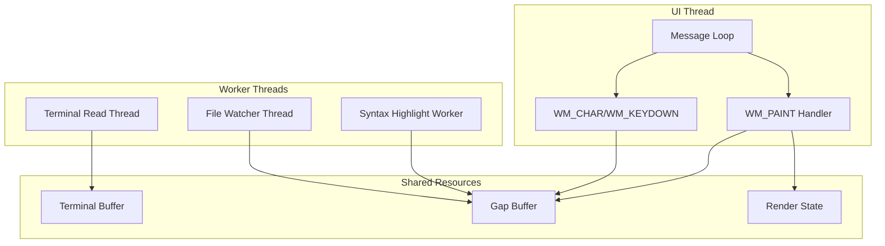

# Qalam IDE - Technical Risk Assessment and Architectural Decisions

## Executive Summary

This document captures critical architectural decisions and technical risk assessments for Qalam IDE, focusing on Windows-specific implementation challenges for Arabic text rendering, bidirectional text handling, and terminal integration.

### Key Decisions Summary

| Area | Decision | Rationale |
|------|----------|-----------|
| **BiDi Implementation** | Windows Uniscribe API | Native Windows integration, no external dependencies, proven Arabic support |
| **Text Rendering** | DirectWrite | Superior Arabic shaping, hardware acceleration, proper ligature support |
| **Terminal Backend** | ConPTY with fallback strategy | Modern API with documented fallback for older Windows |
| **Thread Safety** | SRWLock + Message Queue pattern | Low overhead, Windows-native, appropriate for editor workloads |

### Top 3 Technical Risks

1. 🔴 **ConPTY Windows 1903+ Requirement** - Mitigated with version detection and fallback
2. 🟡 **BiDi Edge Cases** - Mitigated with comprehensive test suite
3. 🟡 **DirectWrite Complexity** - Mitigated with incremental implementation approach

---

## 1. BiDi Algorithm Implementation Analysis

### 1.1 Options Comparison

#### Option A: Windows Uniscribe API

**Overview**: Uniscribe is the Windows native text shaping engine, available since Windows 2000. It provides complete UAX #9 (Unicode Bidirectional Algorithm) implementation.

**Key APIs**:
- [`ScriptItemize()`](https://docs.microsoft.com/en-us/windows/win32/api/usp10/nf-usp10-scriptitemize) - Break text into runs with uniform properties
- [`ScriptLayout()`](https://docs.microsoft.com/en-us/windows/win32/api/usp10/nf-usp10-scriptlayout) - Compute visual-to-logical mapping
- [`ScriptShape()`](https://docs.microsoft.com/en-us/windows/win32/api/usp10/nf-usp10-scriptshape) - Generate glyphs from Unicode text
- [`ScriptPlace()`](https://docs.microsoft.com/en-us/windows/win32/api/usp10/nf-usp10-scriptplace) - Compute glyph positions

| Criterion | Rating | Notes |
|-----------|--------|-------|
| Arabic Script Rendering | ✅ Excellent | Full OpenType support, contextual forms, ligatures |
| Mixed LTR/RTL Handling | ✅ Excellent | Complete UAX #9 implementation |
| Cursor Positioning | ✅ Good | Provides logical-to-visual mapping |
| Selection Handling | ✅ Good | Visual positions available via ScriptCPtoX |
| API Complexity | 🟡 Medium | Multiple API calls needed, but well-documented |
| External Dependencies | ✅ None | Built into Windows |
| Performance | ✅ Excellent | Native, optimized implementation |
| Windows Version Support | ✅ Windows 2000+ | Universal availability |

**Pros**:
- Zero external dependencies
- Battle-tested with Arabic text for 20+ years
- Integrates naturally with DirectWrite
- No DLL distribution needed
- Microsoft documentation and support

**Cons**:
- Windows-only (not portable to other platforms)
- Requires understanding of Windows text APIs
- Some edge cases need careful handling

#### Option B: ICU (International Components for Unicode)

**Overview**: ICU is a mature, cross-platform library providing Unicode support including BiDi algorithm implementation.

| Criterion | Rating | Notes |
|-----------|--------|-------|
| Arabic Script Rendering | ✅ Excellent | Full Unicode support |
| Mixed LTR/RTL Handling | ✅ Excellent | Complete UAX #9 implementation |
| Cursor Positioning | ✅ Good | BiDi reordering APIs available |
| Selection Handling | ✅ Good | Visual-to-logical mapping available |
| API Complexity | 🟡 Medium | Well-designed API, good documentation |
| External Dependencies | 🔴 Heavy | ~25-30 MB DLL, complex build |
| Performance | ✅ Good | Optimized, but adds overhead |
| Windows Version Support | ✅ All | Cross-platform |

**Pros**:
- Cross-platform (future-proofing)
- Comprehensive Unicode support
- Well-maintained by Unicode Consortium
- Extensive localization features

**Cons**:
- **Large dependency** (~25-30 MB DLL distribution)
- Complex build integration
- Redundant with Uniscribe for Windows-only application
- Adds maintenance burden for updates

#### Option C: Custom Implementation

**Overview**: Implement UAX #9 bidirectional algorithm from scratch.

| Criterion | Rating | Notes |
|-----------|--------|-------|
| Arabic Script Rendering | 🟡 Requires additional work | BiDi alone doesn't handle shaping |
| Mixed LTR/RTL Handling | 🔴 High risk | UAX #9 is complex, error-prone |
| Cursor Positioning | 🔴 High risk | Must implement from scratch |
| Selection Handling | 🔴 High risk | Complex with mixed directions |
| API Complexity | 🔴 High | Must design and maintain API |
| External Dependencies | ✅ None | Self-contained |
| Performance | 🟡 Variable | Depends on implementation quality |
| Windows Version Support | ✅ All | Custom code |

**Pros**:
- Full control over implementation
- No external dependencies
- Learning opportunity

**Cons**:
- **UAX #9 is extremely complex** (150+ pages specification)
- High risk of subtle bugs with edge cases
- Significant development time (estimated 4-6 weeks)
- Ongoing maintenance burden
- Already solved problem - reinventing the wheel

### 1.2 Recommendation: Windows Uniscribe API

**Decision**: Use Windows Uniscribe API for BiDi text handling.

**Justification**:
1. **Zero dependency overhead** - Critical for a lightweight native application
2. **Proven Arabic support** - Microsoft has 20+ years of Arabic text handling
3. **DirectWrite integration** - Uniscribe concepts map directly to DirectWrite
4. **No distribution concerns** - No DLLs to ship or update
5. **Performance** - Native, optimized implementation

**Implementation Strategy**:

```c
// bidi.h - BiDi analysis interface using Uniscribe

typedef enum {
    TEXT_DIR_LTR = 0,
    TEXT_DIR_RTL = 1,
    TEXT_DIR_AUTO = 2
} TextDirection;

typedef struct {
    size_t start;           // Start position in logical order
    size_t length;          // Length in characters
    TextDirection direction; // Run direction
    int bidi_level;         // UAX #9 embedding level
} BidiRun;

typedef struct {
    BidiRun* runs;
    size_t run_count;
    size_t* logical_to_visual;  // Mapping arrays
    size_t* visual_to_logical;
    TextDirection base_direction;
    size_t text_length;
} BidiLayout;

// Core API
QalamResult bidi_analyze(const wchar_t* text, size_t length, 
                         TextDirection base_dir, BidiLayout** layout);
void bidi_layout_destroy(BidiLayout* layout);

// Position conversion
size_t bidi_logical_to_visual(const BidiLayout* layout, size_t logical_pos);
size_t bidi_visual_to_logical(const BidiLayout* layout, size_t visual_pos);

// Cursor movement
size_t bidi_move_visual_left(const BidiLayout* layout, size_t logical_pos);
size_t bidi_move_visual_right(const BidiLayout* layout, size_t logical_pos);
```

### 1.3 BiDi Edge Cases Requiring Testing

#### Critical Test Cases

| # | Edge Case | Example | Expected Behavior |
|---|-----------|---------|-------------------|
| 1 | Arabic with embedded English | `مرحبا Hello عالم` | English surrounded by Arabic renders correctly |
| 2 | Arabic with embedded numbers | `السعر 123 ريال` | Numbers maintain LTR within RTL context |
| 3 | Nested directional overrides | `‫RTL ‪LTR‬ RTL‬` | Proper nesting of LRO/RLO/PDF markers |
| 4 | Neutral at RTL/LTR boundary | `Hello! مرحبا` | Punctuation follows adjacent strong character |
| 5 | Isolated punctuation | `(مرحبا)` | Parentheses mirror in RTL context |
| 6 | Mixed numbers and Arabic | `٢٠٢٤/١/٥` | Arabic-Indic numerals render RTL |
| 7 | URL in Arabic text | `الموقع http://x.com هنا` | URL renders LTR within RTL paragraph |
| 8 | Email in Arabic text | `بريدي test@x.com` | Email renders LTR |
| 9 | Empty line direction | `` (empty) | Inherits paragraph direction |
| 10 | Single neutral character | `.` | Uses paragraph direction |
| 11 | Cursor at direction boundary | Between `a` and `م` | Clear visual feedback |
| 12 | Selection across directions | Selecting `abc مرحبا xyz` | Non-contiguous visual highlight |

#### Test Implementation Priority

```c
// test_bidi.c - Critical edge case tests

void test_arabic_with_english(void) {
    const wchar_t* text = L"مرحبا Hello عالم";
    BidiLayout* layout = NULL;
    bidi_analyze(text, wcslen(text), TEXT_DIR_RTL, &layout);
    
    // Verify run decomposition
    assert(layout->run_count == 3);
    assert(layout->runs[0].direction == TEXT_DIR_RTL);  // مرحبا
    assert(layout->runs[1].direction == TEXT_DIR_LTR);  // Hello
    assert(layout->runs[2].direction == TEXT_DIR_RTL);  // عالم
    
    // Verify visual order: عالم Hello مرحبا (RTL paragraph)
    // Visual position 0 should map to logical position of عالم
    
    bidi_layout_destroy(layout);
}

void test_cursor_at_boundary(void) {
    const wchar_t* text = L"ABCمرحبا";
    BidiLayout* layout = NULL;
    bidi_analyze(text, wcslen(text), TEXT_DIR_LTR, &layout);
    
    // Cursor between 'C' (pos 2) and 'م' (pos 3)
    // Visual left should move to 'B'
    // Visual right should move into Arabic
    size_t pos = 3;
    size_t left = bidi_move_visual_left(layout, pos);
    size_t right = bidi_move_visual_right(layout, pos);
    
    assert(left == 2);  // Move to 'C'
    assert(right == 4); // Move into Arabic (visual right in RTL = logical next)
    
    bidi_layout_destroy(layout);
}
```

---

## 2. DirectWrite vs GDI+ Analysis

### 2.1 Detailed Comparison

| Criterion | DirectWrite | GDI+ | Winner |
|-----------|-------------|------|--------|
| **Arabic Ligature Support** | ✅ Full automatic ligatures via OpenType | ⚠️ Limited, requires manual handling | DirectWrite |
| **Contextual Shaping** | ✅ Automatic Arabic contextual forms (initial, medial, final, isolated) | ❌ No automatic shaping | DirectWrite |
| **Performance** | ✅ Hardware-accelerated via Direct2D | ⚠️ Software rendering, GDI fallback | DirectWrite |
| **Windows Version Support** | ✅ Windows 7+ (with Platform Update) | ✅ Windows XP+ | GDI+ (wider) |
| **API Complexity** | 🟡 Moderate - COM-based | ✅ Simple - GDI+ flat API | GDI+ |
| **Font Fallback** | ✅ Automatic font fallback chains | ⚠️ Manual fallback required | DirectWrite |
| **HiDPI Support** | ✅ Native DPI awareness, proper scaling | ⚠️ Requires manual DPI handling | DirectWrite |
| **Subpixel Rendering** | ✅ ClearType with advanced options | ⚠️ Basic ClearType | DirectWrite |
| **Memory Usage** | 🟡 Higher (D2D resources) | ✅ Lower | GDI+ |
| **Text Layout** | ✅ Advanced layout engine | ⚠️ Basic layout | DirectWrite |

### 2.2 Arabic-Specific Comparison

#### Arabic Text Shaping Example

```
Input Unicode: ب ي ت (separate letters)
```

| Feature | DirectWrite | GDI+ |
|---------|-------------|------|
| **Ligature Formation** | Automatically forms بيت with proper connections | Shows ب ي ت separately unless manually shaped |
| **Initial Form** (ب at start) | ✅ Automatic | ❌ Manual lookup required |
| **Medial Form** (ي in middle) | ✅ Automatic | ❌ Manual lookup required |
| **Final Form** (ت at end) | ✅ Automatic | ❌ Manual lookup required |
| **Kashida Justification** | ✅ Supported | ❌ Not supported |
| **Diacritics Positioning** | ✅ Proper stacking | ⚠️ May overlap |

### 2.3 Recommendation: DirectWrite

**Decision**: Use DirectWrite for all text rendering.

**Justification**:
1. **Arabic shaping is mandatory** - GDI+ cannot properly render Arabic without significant additional work
2. **Performance** - Hardware acceleration essential for smooth scrolling
3. **HiDPI native** - Modern displays require proper DPI handling
4. **Font fallback** - Automatic fallback chains for missing glyphs
5. **Future-proof** - Microsoft's strategic direction for text rendering

### 2.4 Implementation Strategy

#### Sprint 1: Minimum Viable Implementation

```c
// ui_text.c - Sprint 1 DirectWrite implementation

typedef struct {
    IDWriteFactory* factory;
    IDWriteTextFormat* default_format;
    IDWriteTextFormat* arabic_format;
    ID2D1Factory* d2d_factory;
    ID2D1HwndRenderTarget* render_target;
    ID2D1SolidColorBrush* text_brush;
} QalamTextContext;

QalamResult text_context_create(HWND hwnd, QalamTextContext** ctx) {
    QalamTextContext* c = calloc(1, sizeof(QalamTextContext));
    if (!c) return QALAM_ERROR_OUT_OF_MEMORY;
    
    // Create DirectWrite factory
    HRESULT hr = DWriteCreateFactory(
        DWRITE_FACTORY_TYPE_SHARED,
        &IID_IDWriteFactory,
        (IUnknown**)&c->factory
    );
    if (FAILED(hr)) {
        free(c);
        return QALAM_ERROR_DIRECTWRITE_INIT;
    }
    
    // Create text formats
    hr = c->factory->lpVtbl->CreateTextFormat(
        c->factory,
        L"Cascadia Code",  // Fallback: Consolas, Courier New
        NULL,
        DWRITE_FONT_WEIGHT_NORMAL,
        DWRITE_FONT_STYLE_NORMAL,
        DWRITE_FONT_STRETCH_NORMAL,
        14.0f,
        L"en-US",
        &c->default_format
    );
    
    // Arabic-specific format with RTL reading direction
    hr = c->factory->lpVtbl->CreateTextFormat(
        c->factory,
        L"Cascadia Code",
        NULL,
        DWRITE_FONT_WEIGHT_NORMAL,
        DWRITE_FONT_STYLE_NORMAL,
        DWRITE_FONT_STRETCH_NORMAL,
        14.0f,
        L"ar",  // Arabic locale
        &c->arabic_format
    );
    
    c->arabic_format->lpVtbl->SetReadingDirection(
        c->arabic_format,
        DWRITE_READING_DIRECTION_RIGHT_TO_LEFT
    );
    
    // Create Direct2D factory and render target
    // ... (D2D initialization code)
    
    *ctx = c;
    return QALAM_OK;
}

// Simple text rendering for Sprint 1
QalamResult text_draw_line(QalamTextContext* ctx, 
                           const wchar_t* text, size_t length,
                           float x, float y, bool is_rtl) {
    IDWriteTextFormat* format = is_rtl ? ctx->arabic_format : ctx->default_format;
    
    IDWriteTextLayout* layout = NULL;
    HRESULT hr = ctx->factory->lpVtbl->CreateTextLayout(
        ctx->factory,
        text, (UINT32)length,
        format,
        10000.0f,  // Max width
        1000.0f,   // Max height
        &layout
    );
    
    if (SUCCEEDED(hr)) {
        ctx->render_target->lpVtbl->DrawTextLayout(
            ctx->render_target,
            (D2D1_POINT_2F){x, y},
            layout,
            (ID2D1Brush*)ctx->text_brush,
            D2D1_DRAW_TEXT_OPTIONS_NONE
        );
        layout->lpVtbl->Release(layout);
    }
    
    return QALAM_OK;
}
```

#### Production: Full Implementation Requirements

For production, extend with:

1. **Text Layout Caching**
   - Cache `IDWriteTextLayout` objects per line
   - Invalidate on content change
   - LRU eviction for memory management

2. **Hit Testing**
   - Implement `IDWriteTextLayout::HitTestPoint()` for mouse click
   - Map pixel coordinates to text positions

3. **Selection Rendering**
   - Use `IDWriteTextLayout::HitTestTextRange()` for selection rectangles
   - Handle non-contiguous selection in BiDi text

4. **Font Fallback Chain**
   - Create custom `IDWriteFontFallback` for Arabic
   - Priority: Cascadia Code → Consolas → Courier New → Arial

5. **DPI Handling**
   - Recreate render target on DPI change
   - Scale font sizes appropriately

### 2.5 Migration Path: GDI+ to DirectWrite

If starting with GDI+ for rapid prototyping:

| Phase | Implementation | Risk |
|-------|----------------|------|
| Prototype | GDI+ for basic window rendering | Low - simple API |
| Sprint 1 | DirectWrite for editor text only | Medium - learning curve |
| Sprint 2 | Full DirectWrite for all text | Low - incremental |
| Production | Remove all GDI+ code | Low - clean transition |

**Note**: Given Arabic requirements, **starting with DirectWrite is strongly recommended** to avoid later migration issues.

---

## 3. ConPTY Risk Mitigation Strategy

### 3.1 Windows Version Requirements

**ConPTY Minimum**: Windows 10 version 1903 (Build 18362)

```c
// version.h - Version detection

typedef struct {
    DWORD major;
    DWORD minor;
    DWORD build;
} WindowsVersion;

// Get Windows version using RtlGetVersion (not deprecated)
QalamResult get_windows_version(WindowsVersion* ver) {
    typedef NTSTATUS (WINAPI *RtlGetVersionPtr)(PRTL_OSVERSIONINFOW);
    
    HMODULE ntdll = GetModuleHandleW(L"ntdll.dll");
    if (!ntdll) return QALAM_ERROR_UNKNOWN;
    
    RtlGetVersionPtr rtl_get_version = 
        (RtlGetVersionPtr)GetProcAddress(ntdll, "RtlGetVersion");
    if (!rtl_get_version) return QALAM_ERROR_UNKNOWN;
    
    RTL_OSVERSIONINFOW osvi = {sizeof(osvi)};
    if (rtl_get_version(&osvi) != 0) return QALAM_ERROR_UNKNOWN;
    
    ver->major = osvi.dwMajorVersion;
    ver->minor = osvi.dwMinorVersion;
    ver->build = osvi.dwBuildNumber;
    
    return QALAM_OK;
}

// Check if ConPTY is available
bool is_conpty_available(void) {
    WindowsVersion ver;
    if (get_windows_version(&ver) != QALAM_OK) return false;
    
    // Windows 10 (major=10, minor=0) build 18362+
    if (ver.major > 10) return true;
    if (ver.major < 10) return false;
    if (ver.build >= 18362) return true;
    
    return false;
}

// Runtime check for CreatePseudoConsole
bool check_conpty_api(void) {
    HMODULE kernel32 = GetModuleHandleW(L"kernel32.dll");
    if (!kernel32) return false;
    
    return GetProcAddress(kernel32, "CreatePseudoConsole") != NULL;
}
```

### 3.2 Fallback Strategy Options

#### Option 1: Disable Terminal Feature (Recommended for Sprint 1)

```c
typedef enum {
    TERMINAL_MODE_CONPTY,      // Full ConPTY support
    TERMINAL_MODE_DISABLED,    // Terminal feature disabled
    TERMINAL_MODE_EXTERNAL     // Launch external terminal
} TerminalMode;

TerminalMode determine_terminal_mode(void) {
    if (is_conpty_available() && check_conpty_api()) {
        return TERMINAL_MODE_CONPTY;
    }
    
    // For older Windows, disable embedded terminal
    return TERMINAL_MODE_DISABLED;
}

// UI handling for disabled mode
void show_terminal_unavailable_message(HWND parent) {
    MessageBoxW(parent,
        L"الطرفية المدمجة تتطلب Windows 10 الإصدار 1903 أو أحدث.\n"
        L"Embedded terminal requires Windows 10 version 1903 or later.\n\n"
        L"يمكنك استخدام طرفية خارجية بدلاً من ذلك.\n"
        L"You can use an external terminal instead.",
        L"قلم - Qalam IDE",
        MB_OK | MB_ICONINFORMATION
    );
}
```

#### Option 2: Classic Console API Fallback (Complex)

**Not recommended** for Sprint 1 due to complexity:

- Requires `AttachConsole()` / `AllocConsole()` approach
- Limited ANSI support on older Windows
- No proper VT100 emulation
- Significant additional development effort

#### Option 3: Require Windows Update (Production)

```c
// startup.c - Version check at startup

int WINAPI wWinMain(HINSTANCE hInstance, HINSTANCE hPrev, 
                    LPWSTR lpCmdLine, int nCmdShow) {
    WindowsVersion ver;
    get_windows_version(&ver);
    
    // Check minimum Windows version for core features
    if (ver.major < 10 || (ver.major == 10 && ver.build < 18362)) {
        int result = MessageBoxW(NULL,
            L"قلم يتطلب Windows 10 الإصدار 1903 أو أحدث للعمل بشكل كامل.\n"
            L"Qalam requires Windows 10 version 1903 or later for full functionality.\n\n"
            L"هل تريد المتابعة مع ميزات محدودة؟\n"
            L"Do you want to continue with limited features?",
            L"تحذير إصدار Windows",
            MB_YESNO | MB_ICONWARNING
        );
        
        if (result != IDYES) {
            return 1;
        }
        
        // Set global flag to disable terminal features
        g_terminal_mode = TERMINAL_MODE_DISABLED;
    }
    
    // Continue with initialization...
    return qalam_main(hInstance, nCmdShow);
}
```

### 3.3 Testing Matrix

| Windows Version | Build | ConPTY | VT100 | Test Priority |
|-----------------|-------|--------|-------|---------------|
| Windows 11 | 22000+ | ✅ | ✅ | High |
| Windows 10 21H2 | 19044 | ✅ | ✅ | High |
| Windows 10 1903 | 18362 | ✅ | ✅ | High (boundary) |
| Windows 10 1809 | 17763 | ❌ | ✅ | Medium |
| Windows 10 1803 | 17134 | ❌ | Partial | Medium |
| Windows 10 1709 | 16299 | ❌ | Partial | Low |
| Windows 7 | 7601 | ❌ | ❌ | Low (not supported) |

### 3.4 Performance Implications

| Mode | Performance | Features |
|------|-------------|----------|
| ConPTY | ✅ Excellent | Full terminal emulation, proper PTY semantics |
| Disabled | N/A | No terminal, only editor functionality |
| External | ⚠️ Variable | User launches cmd.exe/PowerShell separately |

---

## 4. Thread Safety Patterns

### 4.1 Threading Model Overview



### 4.2 Synchronization Primitives Selection

#### Recommended: SRWLock (Slim Reader/Writer Lock)

```c
// thread_safety.h

#include <windows.h>

// SRWLock wrapper for cleaner API
typedef struct {
    SRWLOCK lock;
} QalamLock;

static inline void qalam_lock_init(QalamLock* lock) {
    InitializeSRWLock(&lock->lock);
}

static inline void qalam_lock_read(QalamLock* lock) {
    AcquireSRWLockShared(&lock->lock);
}

static inline void qalam_unlock_read(QalamLock* lock) {
    ReleaseSRWLockShared(&lock->lock);
}

static inline void qalam_lock_write(QalamLock* lock) {
    AcquireSRWLockExclusive(&lock->lock);
}

static inline void qalam_unlock_write(QalamLock* lock) {
    ReleaseSRWLockExclusive(&lock->lock);
}

// No destroy needed - SRWLock is stateless
```

**Why SRWLock over Critical Section**:
| Feature | SRWLock | Critical Section |
|---------|---------|------------------|
| Reader/Writer semantics | ✅ Yes | ❌ No (exclusive only) |
| Size | 8 bytes | 24+ bytes |
| Initialization | Static (no function call) | Requires InitializeCriticalSection |
| Performance (uncontended) | ✅ Very fast | ✅ Fast |
| Performance (contended reads) | ✅ Parallel reads | ❌ Serialized |

### 4.3 Pattern 1: Terminal Read Thread

```c
// terminal_thread.c

typedef struct {
    QalamTerminal* terminal;
    HANDLE pipe_read;
    HANDLE stop_event;
    HANDLE thread;
    
    // Thread-safe output buffer
    QalamLock output_lock;
    char* output_buffer;
    size_t output_size;
    size_t output_capacity;
    
    // Callback to notify UI thread
    HWND notify_hwnd;
    UINT notify_message;
} TerminalReadThread;

#define WM_TERMINAL_OUTPUT (WM_USER + 100)

DWORD WINAPI terminal_read_thread_proc(LPVOID param) {
    TerminalReadThread* ctx = (TerminalReadThread*)param;
    char buffer[4096];
    DWORD bytes_read;
    
    while (true) {
        // Check for stop signal
        if (WaitForSingleObject(ctx->stop_event, 0) == WAIT_OBJECT_0) {
            break;
        }
        
        // Non-blocking read with timeout
        DWORD available = 0;
        if (!PeekNamedPipe(ctx->pipe_read, NULL, 0, NULL, &available, NULL)) {
            break;  // Pipe closed
        }
        
        if (available == 0) {
            Sleep(10);  // Brief sleep to avoid busy-waiting
            continue;
        }
        
        if (!ReadFile(ctx->pipe_read, buffer, sizeof(buffer), &bytes_read, NULL)) {
            break;  // Read error
        }
        
        if (bytes_read > 0) {
            // Acquire write lock and append to buffer
            qalam_lock_write(&ctx->output_lock);
            
            // Grow buffer if needed
            if (ctx->output_size + bytes_read > ctx->output_capacity) {
                size_t new_capacity = ctx->output_capacity * 2;
                if (new_capacity < ctx->output_size + bytes_read) {
                    new_capacity = ctx->output_size + bytes_read + 4096;
                }
                char* new_buffer = realloc(ctx->output_buffer, new_capacity);
                if (new_buffer) {
                    ctx->output_buffer = new_buffer;
                    ctx->output_capacity = new_capacity;
                }
            }
            
            memcpy(ctx->output_buffer + ctx->output_size, buffer, bytes_read);
            ctx->output_size += bytes_read;
            
            qalam_unlock_write(&ctx->output_lock);
            
            // Notify UI thread (non-blocking)
            PostMessageW(ctx->notify_hwnd, ctx->notify_message, 0, 0);
        }
    }
    
    return 0;
}

// UI thread handler - called from message loop
void handle_terminal_output(QalamWindow* win) {
    TerminalReadThread* ctx = &win->terminal_read_ctx;
    
    // Acquire read lock and copy data
    qalam_lock_read(&ctx->output_lock);
    
    if (ctx->output_size > 0) {
        // Process output (parse ANSI, update terminal buffer)
        terminal_process_output(win->terminal, ctx->output_buffer, ctx->output_size);
        
        // Clear buffer (need write lock for this)
        qalam_unlock_read(&ctx->output_lock);
        qalam_lock_write(&ctx->output_lock);
        ctx->output_size = 0;
        qalam_unlock_write(&ctx->output_lock);
    } else {
        qalam_unlock_read(&ctx->output_lock);
    }
    
    // Request repaint
    InvalidateRect(win->hwnd, &win->terminal_rect, FALSE);
}
```

### 4.4 Pattern 2: Buffer Modifications from Multiple Sources

```c
// buffer_sync.c

typedef struct {
    QalamBuffer* buffer;
    QalamLock lock;
    
    // Modification tracking for undo
    size_t version;
} SyncBuffer;

// User input - called from UI thread
QalamResult sync_buffer_insert(SyncBuffer* sb, size_t pos, 
                                const wchar_t* text, size_t len) {
    qalam_lock_write(&sb->lock);
    
    QalamResult result = buffer_insert(sb->buffer, pos, text, len);
    if (result == QALAM_OK) {
        sb->version++;
    }
    
    qalam_unlock_write(&sb->lock);
    return result;
}

// File change notification - called from watcher thread
void sync_buffer_file_changed(SyncBuffer* sb, const wchar_t* new_content, 
                              size_t len, HWND notify_hwnd) {
    // Don't modify directly - post message to UI thread
    FileChangeData* data = malloc(sizeof(FileChangeData) + len * sizeof(wchar_t));
    data->length = len;
    memcpy(data->content, new_content, len * sizeof(wchar_t));
    
    // UI thread will handle the actual modification
    PostMessageW(notify_hwnd, WM_FILE_CHANGED, (WPARAM)sb, (LPARAM)data);
}

// Reading for rendering - can be parallel
QalamResult sync_buffer_get_line(SyncBuffer* sb, size_t line,
                                  wchar_t* out, size_t max_len) {
    qalam_lock_read(&sb->lock);
    QalamResult result = buffer_get_line(sb->buffer, line, out, max_len);
    qalam_unlock_read(&sb->lock);
    return result;
}
```

### 4.5 Pattern 3: UI Thread vs Worker Thread Communication

```c
// work_queue.h - Lock-free work queue for background tasks

#define WORK_QUEUE_SIZE 256

typedef struct {
    void (*function)(void* data);
    void* data;
} WorkItem;

typedef struct {
    WorkItem items[WORK_QUEUE_SIZE];
    volatile LONG head;  // Producer writes
    volatile LONG tail;  // Consumer reads
    HANDLE work_semaphore;
    HANDLE stop_event;
    HANDLE thread;
} WorkQueue;

// Producer (UI thread)
bool work_queue_push(WorkQueue* queue, void (*func)(void*), void* data) {
    LONG current_head = queue->head;
    LONG next_head = (current_head + 1) % WORK_QUEUE_SIZE;
    
    // Check if queue is full
    if (next_head == queue->tail) {
        return false;  // Queue full
    }
    
    queue->items[current_head].function = func;
    queue->items[current_head].data = data;
    
    // Memory barrier before publishing
    MemoryBarrier();
    
    InterlockedExchange(&queue->head, next_head);
    ReleaseSemaphore(queue->work_semaphore, 1, NULL);
    
    return true;
}

// Consumer (worker thread)
DWORD WINAPI work_queue_thread(LPVOID param) {
    WorkQueue* queue = (WorkQueue*)param;
    HANDLE handles[2] = {queue->work_semaphore, queue->stop_event};
    
    while (true) {
        DWORD result = WaitForMultipleObjects(2, handles, FALSE, INFINITE);
        
        if (result == WAIT_OBJECT_0 + 1) {
            break;  // Stop event signaled
        }
        
        if (result == WAIT_OBJECT_0) {
            LONG current_tail = queue->tail;
            
            if (current_tail != queue->head) {
                WorkItem item = queue->items[current_tail];
                
                InterlockedExchange(&queue->tail, 
                                   (current_tail + 1) % WORK_QUEUE_SIZE);
                
                // Execute work item
                item.function(item.data);
            }
        }
    }
    
    return 0;
}
```

### 4.6 Thread Safety Summary

| Resource | Lock Type | Readers | Writers |
|----------|-----------|---------|---------|
| Gap Buffer | SRWLock | UI thread (render), Syntax highlighter | UI thread (edit) |
| Terminal Output Buffer | SRWLock | UI thread (render) | Read thread |
| Line Cache | SRWLock | UI thread (render) | Edit operations |
| Undo Stack | SRWLock (exclusive) | N/A | UI thread only |
| File Watcher Notifications | Message Queue | N/A | Watcher thread posts |

---

## 5. Additional Technical Risks

### 5.1 Memory Management in Gap Buffer with Large Files

#### Risk Assessment

| File Size | Gap Buffer Behavior | Risk Level |
|-----------|---------------------|------------|
| < 1 MB | Normal operation | 🟢 Low |
| 1 - 10 MB | Increased memory, slower gap moves | 🟡 Medium |
| 10 - 100 MB | Significant memory, noticeable latency | 🟡 Medium |
| > 100 MB | Potential OOM, unacceptable latency | 🔴 High |

#### Mitigation Strategy

```c
// buffer_limits.h

#define QALAM_MAX_FILE_SIZE      (10 * 1024 * 1024)  // 10 MB
#define QALAM_WARN_FILE_SIZE     (5 * 1024 * 1024)   // 5 MB
#define QALAM_LARGE_FILE_CHUNK   (64 * 1024)         // 64 KB chunks

typedef enum {
    FILE_SIZE_NORMAL,
    FILE_SIZE_LARGE,
    FILE_SIZE_TOO_LARGE
} FileSizeCategory;

FileSizeCategory categorize_file_size(DWORD size) {
    if (size > QALAM_MAX_FILE_SIZE) return FILE_SIZE_TOO_LARGE;
    if (size > QALAM_WARN_FILE_SIZE) return FILE_SIZE_LARGE;
    return FILE_SIZE_NORMAL;
}

// Show warning for large files
QalamResult buffer_load_with_size_check(QalamBuffer* buf, 
                                        const wchar_t* path, HWND hwnd) {
    WIN32_FILE_ATTRIBUTE_DATA attrs;
    if (!GetFileAttributesExW(path, GetFileExInfoStandard, &attrs)) {
        return QALAM_ERROR_FILE_NOT_FOUND;
    }
    
    FileSizeCategory cat = categorize_file_size(attrs.nFileSizeLow);
    
    if (cat == FILE_SIZE_TOO_LARGE) {
        MessageBoxW(hwnd,
            L"الملف كبير جداً (أكثر من 10 ميجابايت).\n"
            L"File is too large (over 10 MB).\n\n"
            L"يرجى استخدام محرر آخر للملفات الكبيرة.\n"
            L"Please use another editor for large files.",
            L"قلم - Qalam IDE",
            MB_OK | MB_ICONWARNING
        );
        return QALAM_ERROR_FILE_TOO_LARGE;
    }
    
    if (cat == FILE_SIZE_LARGE) {
        int result = MessageBoxW(hwnd,
            L"الملف كبير (أكثر من 5 ميجابايت).\n"
            L"File is large (over 5 MB).\n\n"
            L"قد يكون الأداء بطيئاً. هل تريد المتابعة؟\n"
            L"Performance may be slow. Continue?",
            L"قلم - Qalam IDE",
            MB_YESNO | MB_ICONQUESTION
        );
        
        if (result != IDYES) {
            return QALAM_ERROR_CANCELLED;
        }
    }
    
    return buffer_load(buf, path);
}
```

### 5.2 UTF-8 vs UTF-16 Conversion Overhead

#### Risk: Frequent Encoding Conversions

| Scenario | Conversion | Frequency | Impact |
|----------|------------|-----------|--------|
| File Load | UTF-8 → UTF-16 | Once per file | 🟢 Low |
| File Save | UTF-16 → UTF-8 | Once per save | 🟢 Low |
| Clipboard | UTF-16 ↔ UTF-8 | Per paste/copy | 🟢 Low |
| Terminal I/O | UTF-8 → UTF-16 | Per output chunk | 🟡 Medium |
| LSP Communication | UTF-8 ↔ UTF-16 | Per message | 🟡 Medium |

#### Mitigation: Buffer-Based Conversion

```c
// encoding.h

typedef struct {
    char* utf8_buffer;
    size_t utf8_capacity;
    wchar_t* utf16_buffer;
    size_t utf16_capacity;
} EncodingContext;

// Reusable conversion context to avoid repeated allocations
static __thread EncodingContext g_encoding_ctx = {0};

wchar_t* utf8_to_utf16(const char* utf8, size_t length, size_t* out_length) {
    // Calculate required size
    int wide_len = MultiByteToWideChar(CP_UTF8, 0, utf8, (int)length, NULL, 0);
    if (wide_len <= 0) return NULL;
    
    // Grow thread-local buffer if needed
    if ((size_t)wide_len + 1 > g_encoding_ctx.utf16_capacity) {
        size_t new_cap = (wide_len + 1) * 2;
        wchar_t* new_buf = realloc(g_encoding_ctx.utf16_buffer, 
                                   new_cap * sizeof(wchar_t));
        if (!new_buf) return NULL;
        g_encoding_ctx.utf16_buffer = new_buf;
        g_encoding_ctx.utf16_capacity = new_cap;
    }
    
    // Perform conversion
    MultiByteToWideChar(CP_UTF8, 0, utf8, (int)length, 
                        g_encoding_ctx.utf16_buffer, wide_len);
    g_encoding_ctx.utf16_buffer[wide_len] = L'\0';
    
    if (out_length) *out_length = wide_len;
    return g_encoding_ctx.utf16_buffer;
}

// Clean up thread-local storage on thread exit
void encoding_cleanup(void) {
    free(g_encoding_ctx.utf8_buffer);
    free(g_encoding_ctx.utf16_buffer);
    g_encoding_ctx.utf8_buffer = NULL;
    g_encoding_ctx.utf16_buffer = NULL;
    g_encoding_ctx.utf8_capacity = 0;
    g_encoding_ctx.utf16_capacity = 0;
}
```

### 5.3 DirectWrite Factory Lifecycle Management

#### Risk: Resource Leaks and Factory Mismanagement

```c
// dwrite_lifecycle.c

// Global DirectWrite resources (singleton pattern)
typedef struct {
    IDWriteFactory* factory;
    ID2D1Factory* d2d_factory;
    LONG ref_count;
    CRITICAL_SECTION init_lock;
    bool initialized;
} DWriteGlobals;

static DWriteGlobals g_dwrite = {0};

QalamResult dwrite_init(void) {
    EnterCriticalSection(&g_dwrite.init_lock);
    
    if (g_dwrite.ref_count > 0) {
        g_dwrite.ref_count++;
        LeaveCriticalSection(&g_dwrite.init_lock);
        return QALAM_OK;
    }
    
    // Initialize COM if needed
    HRESULT hr = CoInitializeEx(NULL, COINIT_APARTMENTTHREADED);
    if (FAILED(hr) && hr != S_FALSE && hr != RPC_E_CHANGED_MODE) {
        LeaveCriticalSection(&g_dwrite.init_lock);
        return QALAM_ERROR_D2D_INIT;
    }
    
    // Create DirectWrite factory
    hr = DWriteCreateFactory(
        DWRITE_FACTORY_TYPE_SHARED,
        &IID_IDWriteFactory,
        (IUnknown**)&g_dwrite.factory
    );
    
    if (FAILED(hr)) {
        CoUninitialize();
        LeaveCriticalSection(&g_dwrite.init_lock);
        return QALAM_ERROR_DIRECTWRITE_INIT;
    }
    
    // Create Direct2D factory
    hr = D2D1CreateFactory(
        D2D1_FACTORY_TYPE_SINGLE_THREADED,
        &IID_ID2D1Factory,
        NULL,
        (void**)&g_dwrite.d2d_factory
    );
    
    if (FAILED(hr)) {
        g_dwrite.factory->lpVtbl->Release(g_dwrite.factory);
        g_dwrite.factory = NULL;
        CoUninitialize();
        LeaveCriticalSection(&g_dwrite.init_lock);
        return QALAM_ERROR_D2D_INIT;
    }
    
    g_dwrite.ref_count = 1;
    g_dwrite.initialized = true;
    
    LeaveCriticalSection(&g_dwrite.init_lock);
    return QALAM_OK;
}

void dwrite_shutdown(void) {
    EnterCriticalSection(&g_dwrite.init_lock);
    
    if (g_dwrite.ref_count <= 0) {
        LeaveCriticalSection(&g_dwrite.init_lock);
        return;
    }
    
    g_dwrite.ref_count--;
    
    if (g_dwrite.ref_count == 0 && g_dwrite.initialized) {
        if (g_dwrite.d2d_factory) {
            g_dwrite.d2d_factory->lpVtbl->Release(g_dwrite.d2d_factory);
            g_dwrite.d2d_factory = NULL;
        }
        if (g_dwrite.factory) {
            g_dwrite.factory->lpVtbl->Release(g_dwrite.factory);
            g_dwrite.factory = NULL;
        }
        CoUninitialize();
        g_dwrite.initialized = false;
    }
    
    LeaveCriticalSection(&g_dwrite.init_lock);
}

IDWriteFactory* dwrite_get_factory(void) {
    return g_dwrite.factory;
}

ID2D1Factory* d2d_get_factory(void) {
    return g_dwrite.d2d_factory;
}
```

### 5.4 Window Message Queue with Long Operations

#### Risk: UI Freezing During Long Operations

```c
// async_ops.h - Async operation patterns

typedef struct {
    HWND hwnd;
    void (*operation)(void* data);
    void (*completion)(void* data, HRESULT result);
    void* data;
    HRESULT result;
} AsyncOperation;

#define WM_ASYNC_COMPLETE (WM_USER + 200)

// Run operation on thread pool
void run_async(AsyncOperation* op) {
    // Use Windows thread pool for simple async
    QueueUserWorkItem(async_worker, op, WT_EXECUTEDEFAULT);
}

DWORD WINAPI async_worker(LPVOID param) {
    AsyncOperation* op = (AsyncOperation*)param;
    
    __try {
        op->operation(op->data);
        op->result = S_OK;
    } __except(EXCEPTION_EXECUTE_HANDLER) {
        op->result = E_FAIL;
    }
    
    // Notify UI thread
    PostMessageW(op->hwnd, WM_ASYNC_COMPLETE, 0, (LPARAM)op);
    
    return 0;
}

// Message loop with async handling
LRESULT CALLBACK WndProc(HWND hwnd, UINT msg, WPARAM wParam, LPARAM lParam) {
    switch (msg) {
    case WM_ASYNC_COMPLETE: {
        AsyncOperation* op = (AsyncOperation*)lParam;
        if (op->completion) {
            op->completion(op->data, op->result);
        }
        free(op);
        return 0;
    }
    
    // Keep UI responsive during file operations
    case WM_FILE_OPEN: {
        AsyncOperation* op = malloc(sizeof(AsyncOperation));
        op->hwnd = hwnd;
        op->operation = load_file_async;
        op->completion = load_file_complete;
        op->data = (void*)wParam;  // File path
        run_async(op);
        
        // Show "Loading..." indicator
        show_loading_indicator(hwnd);
        return 0;
    }
    }
    
    return DefWindowProcW(hwnd, msg, wParam, lParam);
}
```

---

## 6. Complete Risk Register

| ID | Risk | Severity | Likelihood | Impact | Status | Mitigation Strategy |
|----|------|----------|------------|--------|--------|---------------------|
| R1 | ConPTY unavailable on Windows < 1903 | 🔴 High | Low | Terminal feature unavailable | ✅ Mitigated | Version detection + disable feature |
| R2 | DirectWrite Arabic shaping edge cases | 🟡 Medium | Medium | Visual artifacts in text | 🔄 Monitoring | Comprehensive test suite |
| R3 | BiDi algorithm bugs with mixed content | 🟡 Medium | Medium | Incorrect text display | 🔄 Monitoring | Use Uniscribe + extensive testing |
| R4 | Gap buffer performance with large files | 🟡 Medium | Low | Slow editing experience | ✅ Mitigated | File size limits + warnings |
| R5 | Memory leaks in COM/DirectWrite | 🟡 Medium | Medium | Memory growth over time | 🔄 Monitoring | Reference counting + debug tools |
| R6 | Thread contention on buffer access | 🟡 Medium | Low | UI stuttering | ✅ Mitigated | SRWLock with read/write semantics |
| R7 | UTF-8/UTF-16 conversion overhead | 🟢 Low | Low | Slight performance impact | ✅ Mitigated | Buffer reuse pattern |
| R8 | Font fallback failures | 🟢 Low | Low | Missing glyphs | ⏳ Planned | Custom font fallback chain |
| R9 | DPI change handling | 🟢 Low | Medium | Blurry text after DPI change | ⏳ Planned | Render target recreation |
| R10 | VT100 sequence parsing errors | 🟢 Low | Medium | Terminal display corruption | ⏳ Planned | Comprehensive ANSI parser tests |

---

## 7. Decision Log

| Date | Decision | Rationale | Alternatives Considered | Decided By |
|------|----------|-----------|------------------------|------------|
| 2026-01-05 | Use Uniscribe for BiDi | Zero dependencies, native Windows support, proven Arabic handling | ICU (too large), Custom (too risky) | Technical Analysis |
| 2026-01-05 | Use DirectWrite for rendering | Required for proper Arabic shaping, hardware acceleration | GDI+ (inadequate Arabic support) | Technical Analysis |
| 2026-01-05 | Disable terminal on older Windows | Simplest approach, ConPTY required for proper PTY semantics | Legacy console API (complex), External terminal only | Technical Analysis |
| 2026-01-05 | Use SRWLock for synchronization | Reader/writer semantics, low overhead, Windows-native | Critical Section (no read sharing), std::mutex (C++ only) | Technical Analysis |
| 2026-01-05 | Limit file size to 10 MB | Gap buffer performance degrades with large files | Piece table (complex), No limit (poor UX) | Technical Analysis |
| 2026-01-05 | Thread-local encoding buffers | Avoid repeated allocations for encoding conversion | Per-call allocation (slow), Global buffer (thread safety) | Technical Analysis |

---

## 8. Recommendations for User Input

The following decisions may require user input before proceeding:

### 8.1 Terminal Fallback Strategy

**Question**: For Windows versions older than 1903, should we:
- A) Disable terminal feature entirely (recommended)
- B) Show option to launch external terminal
- C) Display minimum requirements and exit

### 8.2 Large File Handling

**Question**: For files larger than 10 MB, should we:
- A) Refuse to open with error message (recommended)
- B) Open in read-only mode
- C) Suggest external editor and offer to launch it

### 8.3 Font Fallback Priority

**Question**: Preferred font priority for Arabic text:
- Option 1: Cascadia Code → Consolas → Courier New
- Option 2: User-configurable font stack
- Option 3: System default with Arabic fallback

---

*Document Version: 1.0*
*Generated: 2026-01-05*
*Status: Ready for Review*